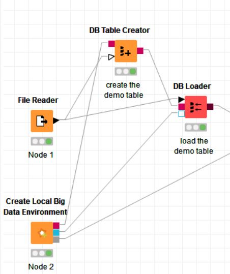
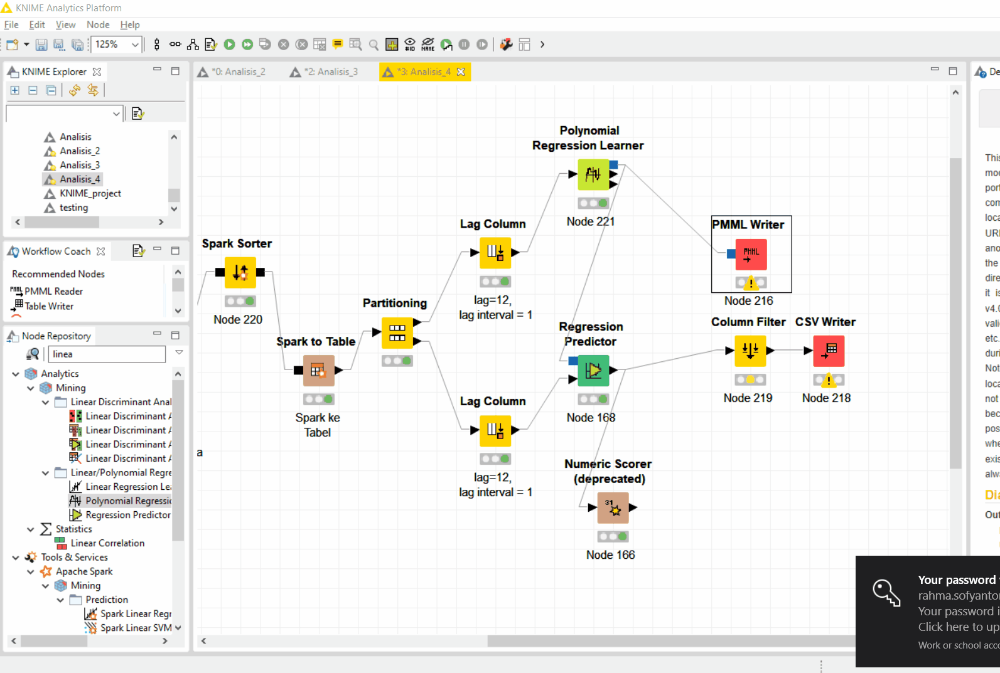

# EAS - Analisis Produksi minumam bir
Nama Mahasiswa : Rahma Sofyantoro | NRP : 05111640000117  

## Daftar Isi  
- [Lampiran](#lampiran)   
- [CRISP-DM](#crisp-dm)   
      [Business Understanding](#business-understanding)   
      [Data Understanding](#data-understanding)   
      [Data Preparation](#data-preparation)   
      [Modeling](#modeling)   
      [Evaluation](#evaluation)   
      [Deployment](#deployment)  

## dataset
[monthly-beer-production-in-austr.csv](dataset/monthly-beer-production-in-austr.csv)   

## Lampiran
[Analisis_4.knwf](lampiran/Analisis_4.knwf)   

## CRISP-DM
### Business Understanding
 Selarasnya tingkat penjualan minuman bir dengan angka kriminalitas perlu menjadi perhatian khusus bagi pemerintah setempat. Salah satu penyebab tingginya penjualan bir  adalah tingginya produksi bir yang ada. Berangkat dari hal tersebut dilakukan studi untuk memprediksi produksi bir selanjutnya. Hasil prediksi ini diharapkan dapat digunakan sebagai kebijakan pengawasan produksi bir selanjutnya.
   
Pada kasus ini dilakukan studi dengan tujuan   
- Memprediksi produksi meniuman bir
   
### Data Understanding
Dataset yang digunakan bersumber dari [monthly-beer-production-in-austr.csv](dataset/monthly-beer-production-in-austr.csv)   
 
, kumpulan penjualan shampoo selama 3 tahun.
Dataset terdiri dari 3 atribut :  
1. **Month** menunjukan bulan terjadinya penjualan
2. **Monthly beer production** jumlah penjualan meninuman bir 
   
Jumlah keseluruhan 478 baris.   
Dibawah ini merupakan sample dari dataset :   
   
### Data Preparation
Pada tahap persiapan data, secara berurutan ***loading* data kedalam Spark**, **Pengubahan field DATE ke bentuk standar SQL**,dan ***Sorting* atribut tanggal**. Data hasil persiapan ini akan menjadi data training dari model.   
#### 1. Loading Data kedalam Spark
Dataset awal yang disimpan dalam bentuk csv dibuka dengan **`Node File Reader`** ,dilanjutkan pembuatan local Spark Contect dengan **`Node Create Local Big Data Environment`** ,lalu data di-*load* kedalam Spark delam bentuk tabel baru. **`Node Table Creator`**  untuk menyimpan dataset kedalam tabel,dan **`Node DB Loader `** untuk loading data kedalam Spark Context.   
   
Berikut skema keseluruhan load data :   
   

Proses keseluruhan :   
   
   
#### 2. Pengubahan field DATE ke bentuk standar SQL
Sebelum pengubahan field,masukan yang masih berupa Hive diubah kedalam Spark SQL. Spark SQL sebagai pengganti Hive untuk query dan analisis dat dengan **`Node Hive to Spark`** . Spark SQL akan melakukan operasi kompleks dalam memori dan mengeksekusi volume data dalam bentuk SparkDataFrame/RDD, sehingga performa lebih cepat dan efisien.  

Field pada **DATE** masih berformat dd/mm/yyyy,sedangkan untuk standar SQL menggunakan yyyy-mm-dd,sehingga data perlu diubah
menjadi format standar. 
   
Pengubahan dilakukan dengan query menggunakan **`node Spark SQL`**.
Mengambil nila-nilai tanggal,bulan,dan tahun dengan regex lalu ditempatkan sesuai format tanggal standar SQL melakukan *concating* data. Data hasil *concating* yang masih berbentuk string dikonversi tipe datanya menjadi Datetime dengan fungsi date. Selanjutnya data ditambah dengan satu hari karena terjadi selisih kurang 1 hari dari data yang asli. Atribut **newDate** sebagai pengganti atribut lama, **DATE** dengan field-field yang sesuai standar SQL.  
Berikut query sql yang digunakan :   
```
SELECT 
date_add(
    date(concat(
      regexp_extract(`DATE`,'([0-9]+)\/([0-9]+)\/([0-9]+)',3),"-",
      regexp_extract(`DATE`,'([0-9]+)\/([0-9]+)\/([0-9]+)',2),"-",
      regexp_extract(`DATE`,'([0-9]+)\/([0-9]+)\/([0-9]+)',1)
      )),1
      ) as newDate,
`IPG2211A2N`FROM #table#
```
Berikut skema Pengubahan field DATE ke bentuk standar SQL :   
   

Proses keseluruhan :   
   

#### 3. Pengubahan field DATE ke bentuk standar SQL
Data masukan selanjutnya akan disorting sesuai urutan atribut **newDate** secara *ascending menggunakan **`Node Spark Sorter`**.
Setelah itu data akan diubah dari bentuk Spark ke tabel KNIME untuk dilakukan *lagging* di tahap modeling. Pengubahan Spark ke tabel Knime menggunakan **`node Spark to Table`**.

Berikut skema Pengubahan field DATE ke bentuk standar SQL :   
   

Proses keseluruhan :   
   

### Modeling
Data masukan dipartisi menjadi data training dan data testing dengan rasio 90%:20%. Pengambilan data dilakukan secara berurutan atau *Take from Top* agar hasil partisi data tetap berurutan. Urutan data ini sangat penting untuk prediksi selanjutnya.   
   
Prediksi data berbasis *time series*  memerlukan beberapa data secara berurut untuk setiap prediksinya atau labelnya. Sedangkan Data masukan hanya memiliki 2 kolom yaitu **newDate** dan **IPG2211A2N**,yang berarti hanya memiliki satu urutan data. Untuk menambah data seri digunakan **`Node Lag Column`**. Masing-masing baris dari data masukan akan dikorelasikan dengan baris dibawahnya secara berurut untuk membentuk satu data seri dengan membuat salinan kolom data input yang dipilih dan menggeser sel ke bawah ke sejumlah langkah tertentu.
   
Berikut paramet **`Node Lag Column`** :   
   

Lag bernilai 7 menunjukan akan ada 7 baris salinan  dari atribut **IPG2211A2N**, sedangkan Lag interval bernilai 1 menunjukan jarak data bergeser kebawah sebanyak 1. Hal ini juga dapat diartikan bahwa prediksi produksi listrik pada bulan tertentu berdasar 7 bulan sebelumnya.

Data hasil **lagging** akan dilatih dalam algoritma Linear Regression menggunakan node **`node Linear Aggression learner`** dengan label data adalah atribut **IPG2211A2N**.

Berikut paramater dari *Linear Regression learner* :   
   

Proses keseluruhan :   
   

### Evaluation  
Pada tahap ini dilakukan evaluasi terhadap model yang sudah dibuat sebelumnya dengan data testing.

Berikut Skema Evaluasi Model :   
   
   
Hasil evaluasi sebagai berikut :   
   

Hasil dari error matrics di atas menunjukan bahma Mean absolute error yaitu 3.784 dan Root mean squared error 0.8, cukup baik karena hanya memiliki simpangan 5.269 dari nilai yang asli, tidak terlalu signifikan berbeda untuk data bernilai puluhan.

### Deployment   
Pada tahap deployement model prediksi akan disimpan dalam bentuk PMML menggunakan **`node PMML Writter`**.
Sedangkan hasil prediksi yang telah dikurangi kolumnya dengan **`node Colum filter`** sehingga tinggla menyisakan  akan disimpan dalam bentuk CSV.
    