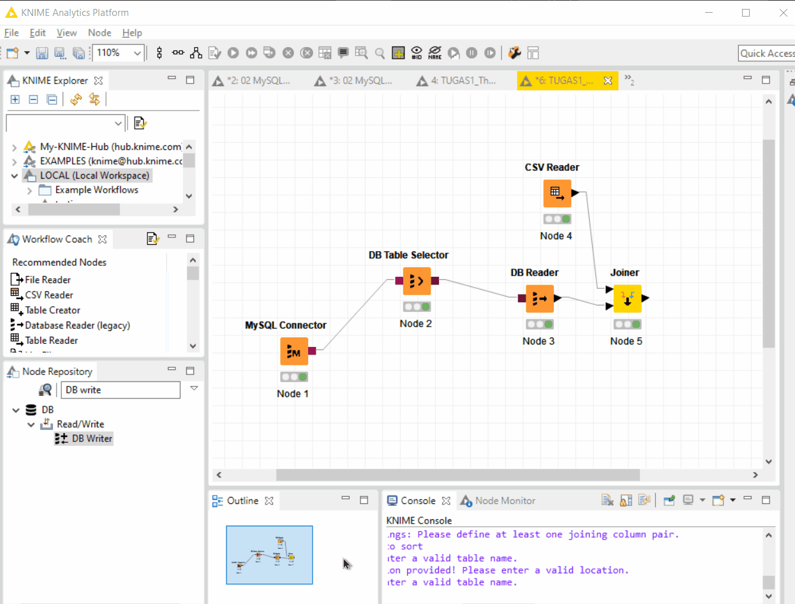

# Tugas 1 - ETL menggunakan KNIME
Nama Mahasiswa : Rahma Sofyantoro | NRP : 05111640000117

## Daftar Isi
- [Lampiran](#Lampiran)
- [Dataset](#Dataset)
- [1. Business Understanding](#1-business-understanding)
- [2. Data Understanding](#2-data-understanding)
- [3. Data Preparation](#3-data-preparation)
- [4. Modeling](#4-modeling)
- [5. Evaluation](#5-evaluation)
- [6. Deployment](#6-Deployment)

## Lampiran
1. [File Dataset](https://raw.githubusercontent.com/rahmsofyan/Big-Data/master/Tugas_1/dataset/human-freedom-index-2019%20.csv)
1. [File Splitting KNIME](https://github.com/rahmsofyan/Big-Data/blob/master/Tugas_1/Knime_files/TUGAS1_The%20Human%20Freedom%20Index_splitting.zip?raw=true)
1. [File Modelling](https://github.com/rahmsofyan/Big-Data/blob/master/Tugas_1/Knime_files/TUGAS1_The%20Human%20Freedom%20Index_ModelingFinal.zip?raw=true)

## Dataset
[The Human Freedom Index (HFI)](https://www.cato.org/human-freedom-index-new) menyajikan indek tingkat kebebasan manusia secara umum , dipahami sebagai tidak adanya kendala koersif,dengan skala 0 hingga 10 (lebih menujukan baik).
Didalamnnya menggunakan 79 indikator berbeda dari kebebasan personal dan ekonomi di bidang-bidang berikut:

- Aturan hukum
- Keamanan dan Keselamatan
- Gerakan
- Agama
- Asosiasi, Majelis, dan Sosial Sipil
- Ekspresi dan Informasi
- Identitas dan Relasi
- Ukuran Pemerintahan
- Sistem Hukum dan Hak Milik
- Akses ke komiditas yang memiliki nilai stabil
- Kebebasan untuk Berdagang Secara Internasional
- Peraturan Kredit, Perburuhan, dan Bisnis

HFI mencakup 162 negara hingga 2017.  
Di dalam dateset terdapat 120 kolom,dengan 1620 record data.   
[Download Dataset]()

## 1. Business Understanding
Dari dataset tersebut dapat dilakukan analisis mengenai :
1. Tingkat persebaran kebebasan di seluruh dunia.
1. Negara - negara dengan tingkat kebebasan tertinggi dan terendah untuk masing-masing indikator
1. Korelasi positif dan negatif antar indikator
1. Negara-negara yang mengalami perubahan signifikan masing-masing indikator dari tahun ke tahun
## 2. Data Understanding
Dari dataset HFI diketahui :
- Dataset terdiri 1620 baris dan 120 kolom.  
- Terdapat 76 Indikator/Kolom kebebasan (33 dari *personal freedom*,43 dari *economic freedom*) berbeda yang ditunjukan pada Gambar 1).  
- Terdapat 4 kolom indentitas lokasi dan waktu yang berkaitan (*year*,ISO_CODE,*countries*,*region*).  
- Setiap kategori indikator memiliki nilai rata-rata dari indikator yang termasuk bagiannya.
- Setiap subkategori indikator memiliki nilai rata-rata dari indikator yang termasuk bagiannya.
- Kategori *Personal Freedom* menganai peraturan hukum dan keamanan terhadap individu, dan kebebasan individu untuk berserikat.
- Pada Kategori *Personal Freedom* terdapat sub-kategori antara lain *Legal Protection and Security* mengenai Peraturan Hukum ,dan Sekuritas Keamanan, *Spesific Personal Freedoms* yang mengenai hubungan individu dengan komunitas atau kelompok-kelompok di dalamnya.
- Kategori *Economic Freedom* mengenai bantuan pemerintah, hak dan legalitas kepemilikan individu, komoditas ,perdaganan internasional, dan regulasi yang mengatur hal-hal yang berkaitan dagan bisnis,ketenagakerjaan,dan kredit.
- Terdapat 3 Kolom final dari kesimpulan dari keselurahan indikator ,yaitu *hf_score* yang menunjukan tingkat HIF dari perhitungan 76 indikator sebelumnya, *hf_rank* ya menunjukan peringkat negara dalam HIF (kecil lebih baik),*hf_quartile* yang menunjukan kuarter peringkat.
## 3. Data Preparation
Pada Data Preparation, dataset dibagi menjadi 2 file dataset.  
- Dataset Pertama merupakan dataset final yang berisikan 4 kolom identitas lokasi dan waktu yang berkaitan, dan kolom final dari kesuluran indikator yaitu *hf_score,hf_rank,hf_quartile*.
- Dataset Kedua merupakan dataset final yang berisikan 4 kolom identitas lokasi dan waktu yang berkaitan, dan 76 indikator kebebasan beserta kategori,dan sub-kategori.

Pembagian data menggunakan KNIME :  
**1. Melakukan pembacaan CSV Reader.**  
  
Menggunakan **Node CSV Reader**,pilh berkas yang akan dibaca,lalu atur konfigurasi.
Pada bagian checkbox *column header* diberikan centang karena dataset memiliki *header name* pada kolum.

**2. Melakukan kolom filter sesuai dangan kriteria dataset pertama.**  
  
Menggunakan **Node Column Filter** dengan mengatur konfigurasi kolom yang akan diikut sertakan pada node selanjutnya.

**3. Melakukan kolom filter sesuai dengan kriteria dataset kedua.**  
  
Menggunakan **Node Column Filter** dengan mengatur konfigurasi kolom yang akan diikut sertakan pada node selanjutnya.

**4. Melakukan write data pada file berbentuk csv untuk dataset pertama dengan nama HFI_Final.csv,dan    dataset kedua dengan nama HFI_Detail.csv.**  
  
Menggunakan **Node CSV Writer**,pada bagian checkbox *write column header* diberikan centang karena dataset ditulis dengan *header name* pada kolum.

**Penyimpanan data HFI_Final.csv pada database :**  
  
Untuk penyimpanan dengan database ini menggunakan MySQL dengan Bantuan PhpMyadmin.

## 4. Modeling
Pada Modeling ini,dataset dimisalkan berasal dari dua sumber sebagaimana telah dilakukan split pada **Data Preparation** sebelumnya, dataset HFI_Final berasal dari database, dan dataset HFI_Detail dari file csv yang disimpan pada direktori umum biasa.

**1. Pembacaan dataset HFI_Final dari database :**  
**1a. Melakukan koneksi database MySql.**  
  
Menggunakan **Node MYSQL Connector**,lalu mengatur konfigurasi hostname sesuai dengan database (pada kasus ini menggunakan localhost) dan database (pada kasus ini menggunakan hfi_db)

**1b. Melakukan seleksi dan read tabel yang akan digunakan.**  
  
Menggunakan **Node DB Table Selector** ,lalu memilih tabel HFI_Final,dilanjutkan
dengan melakukan pembacaan database dengan **DB Reader**.

**2. Pembacaan dataset HFI_Detail dari CSV :**  
**2a. Melakukan pembacaan CSV Reader.**  
  
Menggunakan **Node CSV Reader**,pilih berkas yang akan dibaca yaitu HFI_Detail.csv,lalu atur konfigurasi,pilih berkas yang akan dibaca.Pada bagian checkbox *column header* diberikan centang karena dataset memiliki *header name* pada kolum.

**3. Melakukan Join kedua data yang telah dibaca**  
  
Menggunakan **Node Joiner**, lalu memilih mode join yang akan digunakan ,pada kasus ini menggunakan inner join.

## 5. Evaluation  
  
Pada tahap Evaluasi ini terbentuk 1620 baris dengan kolom 120 sesuai dengan kondisi awal, dapat disimpulkan model telah berhasil.

## 6. Deployment  
Pada tahap Deployment ini, file hasil join akan disimpan ke dalam CSV,dan database dengan nama HFI_Akhir.  
  
*Hasil Model Final*  
**1. Melakukan penyimpanan ke database :**  
  
Menggunakan **Node DB Writer**, yang dihubungkan dari **Node joiner** (hasil akhir pemrosesan data),dan **MySQL Connector**,lalu pilih skema dan tabel yang akan digunakan.

**2. Melakukan penyimpanan ke dalam bentuk file CSV**  
  
Menggunakan **Node CSV Writer** ,yang dihubungkan dari **Noder joiner** (hasil akhir pemrosesan data).
Pada bagian checkbox *write column header* diberikan centang karena dataset ditulis dengan *header name* pada kolum.

