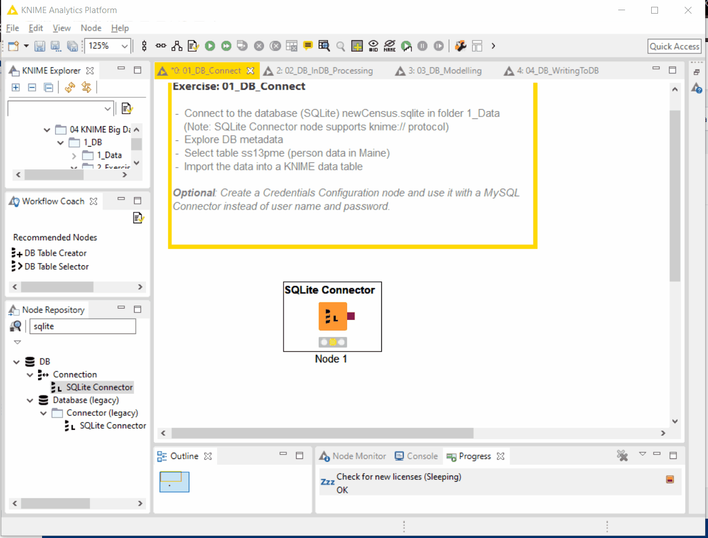
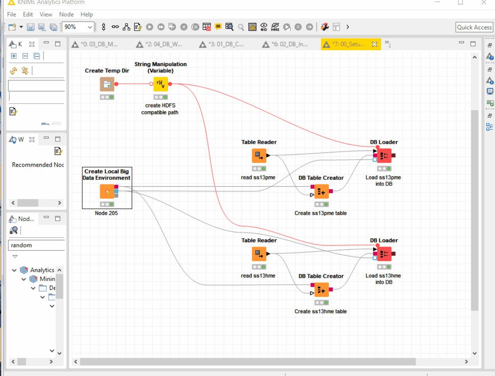
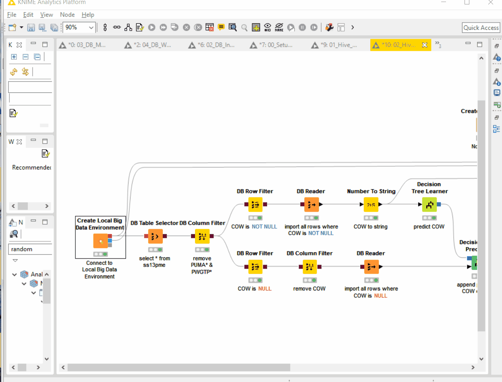

# Tugas 2 - Eksplorasi KNIME Big Data
Nama Mahasiswa : Rahma Sofyantoro | NRP : 05111640000117  

## Daftar Isi
- [Lampiran](#lampiran)
- [1. DB Exercise](#1-db-exercise)
- [2. Hadoop Exervise](#2-hadoop-exercise)

## Lampiran
1. [File Knime](https://api.hub.knime.com/repository//Users/knime/Education/04%20KNIME%20Big%20Data%20Course:data)

## 1. DB Exercise
### 1. DB_Connect

Melakukan koneksi database SQLite menggunakan node SQLite Connector,selanjutnya memilih file database 05111640000117_newCensus.sqlite
05111640000117_newCensus.sqlite merupakan database yang akan digunakan ,dengan tabel berisi 05111640000117_ss13hme dan 05111640000117_ss13pme.
Pengubahan nama tabel dapat dilakukan dengan workflow seperti dibawah dibawah :
   
### 2. DB_InDB_Processing

Hasil dari dari koneksi database sebelumnya,dilakukan pembacaan data dengan filter untuk masing-masing tabel antara lain : gabungan ss13hme dengan ssh13pme berdasar Serial NO,ssh13pme dengan kolom cow NULL, ssh13pme dengan kolom cow NOT NULL,ssh13pme dengan rata-rata gender, dan top 10 ssh13pme berdasar AGEP.   
### 3. DB_Modeling

Pada tahap ini akan dilakukan modeling untuk memprediksikan jenis kolom Cow. Data testing yang digunakan adalah baris dengan nilai kolom Cow kurang dari 5.   
### 4. DB_WritingToDB

Pada tahap ini akan dilakukan penyimpanan kembali setelah dilakukan pembaruan data hasil dari prediksi data, dan dilkakukan penambahan timestamp riwayat waktu pembelajaran model prediksi pada database,dan juga disimpan data sebelumnya sebagai back-up.

## 2. Hadoop Exercise
### 1. Hadoop_Connect

Membuat Hadoop sebagai Local Environment Big Data sementara dengan nama Hadoop_05111640000117,dengan tabel ss13hme,dan tabel ss13pme.   
Berikut evaluasi data untuk menguji data telah tersimpan atau tidak dengan DBeaver :

### 2. Hadoop_Modeling  

Pada tahap ini akan dilakukan modeling untuk memprediksikan jenis kolom Cow. Data testing yang digunakan adalah baris dengan nilai kolom Cow kurang dari 5. 

### 4. Hadoop_WritingToDB  

Pada tahap ini akan dilakukan penyimpanan kembali setelah dilakukan pembaruan data hasil dari prediksi data, dan dilkakukan penambahan timestamp riwayat waktu pembelajaran model prediksi pada database,dan juga disimpan data sebelumnya sebagai back-up.   
Berikut evaluasi data untuk menguji data telah tersimpan atau tidak dengan DBeaver :

