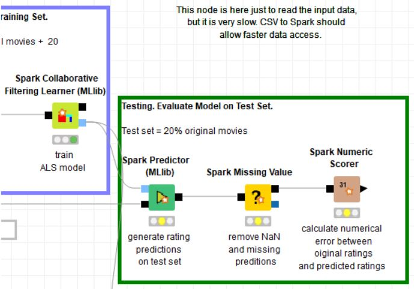

# Tugas 3 - Implementasi Algoritma Rekomendasi
Nama Mahasiswa : Rahma Sofyantoro | NRP : 05111640000117  

## Daftar Isi  
- [Lampiran](#Lampiran)   
- [Dataset](#Dataset)   
- [CRISP-DM](#CRISP-DM)   
   [1. Business Understanding](#1-business-understanding)   
   [2. Data Understanding](#2-data-understanding)   
   [3. Data Preparation](#3-data-preparation)   
   [4. Modeling](#4-modeling)   
   [5. Evaluation](#5-evaluation)   
   [6. Deployment](#6-Deployment)   
- [Perbeedaan File Reader dan CSV to Spark ](#Perbedaan-File-Reader-dan-CSV-to-Spark)   

## Lampiran
[File Modelling KNIME](https://hub.knime.com/knime/spaces/Examples/latest/10_Big_Data/02_Spark_Executor/10_Recommendation_Engine_w_Spark_Collaborative_Filtering)

## Dataset
[MovieLens 20M Dataset](https://grouplens.org/datasets/movielens) 

## CRISP-DM
### 1. Business Understanding
Penyedia layanan media,khususya film seperti Netflix menyediakan banyak hasil produk media, hal ini menjadi sebuah keuntungan bagi penyedia layanan tersebut. 
Pelanggan dapat menikmati berbagai ragam produk yang ditawarkan sesuai dengan minat mereka.
Umumnya, pelanggan dari penyedia layanan tersebut hanya datang untuk menikmati pilihan 
produk yang mereka ketahui informasi sebelumnya,misalkan dari iklan penyedia layanan
atau rekomendasi dari sumber lain. Setelah selesai dengan film mereka, 
mereka tidak tahu lagi produk film mana yang mungkin bisa mereka nikmati dari layanan tersebut. 
Pencarian manual baik dari melalui fitur pencarian atau halaman daftar film 
akan menghabiskan tenaga dari pelanggan. Pelanggan harus membaca deskripi 
yang mungkin disediakan ,atau memutar kilat film tersebut satu-persatu untuk menemukan film yang
sesuai dengan minat meraka. Hal ini akan menyebabkan kejenuhan bagi pelanggan, 
dan mengurangi kepuasan pelanggan, yang pada akhirnya akan menyababkan turunnya pendapatan dari penyedia jasa. Salah satu solusi yang diajukan adalah dengan memberikan rekomendasi 
film untuk pelanggan sesuai berdasar data log seluruh pelanggan.
 
 Pada kasus ini dilakukan studi dengan tujuan
 - Mendapatkan rekomendasi film terbaik untuk pelanggan
 
### 2. Data Understanding
Pada kasus ini menggunakan [Movielens dataset](https://grouplens.org/datasets/movielens/),yaitu movies.csv,dan ratings.csv.   
Dataset ratings.csv terdiri dari 20 juta rating film dengan 130,000 pelanggan circa,
dengan atribut : MovieID,UserID,rating,timestamp.    
Di bawah ini sample data dari ratings.csv :   
   
   
Dataset movies.csv terdiri dari 270,000 film, dengan atribut : movieId,title,genre.   
Di bawah ini sample data dari movies.csv :   
   

### 3. Data Preparation
Pada tahap ini,akan dilakukan pemisahan data ratings,dan movies.   
   
Data ratings akan dipisah menjadi dua bagian : 80% data training,20% data testing
. Data training ini akan ditambahkan dengan 20 data ratings baru dari pelanggan yang telah diinputkan (untuk kasus ini dilakukan secara manual,dan sebagai sampelnya adalah penulis) untuk digunakan sebagai data pelatihan Model Prediksi Rekomendasi Pelanggan terkait menggunakan Collaboratif filtering.   
   
Data movies akan ditambahakn dengan kolom baru yaitu timestamp,dan userid,setelah itu
data akan dipisah menjadi dua bagian : pengambilan 20 data acak untuk dirating manual, dan sisa dari pengambilan tersebut.
    
**3.1 Pemisahan Dataset Ratings**   
Untuk Pemisihan dataset ratings akan disimpan terlebih dahulu dataset ke dalam Spark context, dikarenakan ukuran file yang cukup besar. Hal ini ditujukan untuk mempercepat eksekusi pemisahan data nantinya.
   

Setelah itu dilakukan loading data file ke dalam spark context,dilanjutkan dengan pemisahan dataset untuk training,dan testing.
   

**3.2 Pemisahan Dataset Movies**   
Berbeda dengan dataset ratings,dataset movies akan langsung dilakukan pembacaan dari local direktori,dikarenakan ukuran file yang relatif kecil. 
   
Selanjutnya dilakukan pengacakan baris,dan penambahan kolom timestamp dengan nilai default 123, dan kolom userid dengan nilai default 9999999.
   
Setelah itu,data akan dipisah menjadi dua bagian : pengambilan 20 data acak untuk pemberian rating manual, dan sisa dari data tersebut.   
**3.2.1 Pemberian Data Rating Manual**   
Pada tahap ini akan dimasukan nilai konstan pada kolom ratings yaitu -1,dilakukan input manual untuk nilai rating sebagai data uji coba,dihapuskan kolom title dan genres,penataan ulang urutan kolom,dan filtering data rating untuk menghapus data jika nilai rating masih -1.
Node di bawah merupakan ekpansi dari metanode "Ask User for movie ratings" :
   
Dilakukan input manual rating,selanjutnya data disimpan dalam spark yang akan digunakan untuk data traning dari algoritma collaborative filtering.
   
   
**3.2.2 Sisa Data Rating**   
Pada tahap ini akan dimasukan nilai konstan pada kolom ratings yaitu 0,dihapuskan kolom title dan genres,penataan ulang urutan kolom. Node di bawah merupakan ekpansi dari metanode "no ratings" :
   
Selanjutnya data disimpan dalam spark untuk digunakan sebagai prediksi film yang mungkin disukai atau rekomendasi film berdasar data rating manual sebelumnya.
   

### 4. Modeling
Pada tahap ini dilakukan modeling menggunakan algoritma Collaborative Filtering.
Data yang digunakan untuk pelatihan model adalah 80% dataset training ratings dan 20 data ratings yang telah diinputkan sebelumnya secara manual,kedua dataset tersebut dapat digabungkan dengan fitur Spark concatenate karena memiliki kesesuain struktur tabel.
Setelah itu dilakukan pelatihan data dengan algoritma Collaborative Filtering dengan pengaturan paramater seperti di bawah :   
   
Skema modeling seperti gambar di bawah:   
   

### 5. Evaluation  
Pada tahap ini dilakukan evaluasi terhadap model yang sudah dibuat sebelumnya.
Setiap baris dengan nilai prediksi kosong atau NaN akan dihapus,setalah itu akan dievaluasi dengan membandingkan hasil prediksi dari model dengan 20% dataset testing ratings yang memiliki nilai asli.   

Berikut Skema Evaluasi Model :
   
   
Hasil evaluasi sebagai berikut :   
   
Hasil dari error matrics di atas menunjukan bahma Mean absolute error yaitu 0.615 dan Root mean squared error 0.8, cukup baik karena hanya memiliki simpangan 0.6 dari nilai ratings yang asli, tidak terlalu signifikan berbeda.
### 6. Deployment  
Pada tahap ini dilakukan deployment dengan model yang sudah dibuat dan dievaluasi sebelumnya, untuk memprediksi 10 rekomendasi film berdasar dataset ratings yang diisi manual pada tahap Preparation Data.   
Data hasil prediksi diubah dalam bentuk tabel untuk dilakukan pengapusan prediksi kosong atau NaN,penyortira secara descending sesuai dengan nilai prediksi, penampilan 10 daftar teratas,
dan penggabungan dengan movie titlem,dan genre.   
Berikut Skema Deployment :
   
   
Berikut Skema Ekspansi metanode "Top 20 Recommended movies" :
   

Hasil dari prediksi :   
   

Sehingga dapat disimpulkan dari hasil studi di atas berhasil mendapatkan rekomendasi film terbaik untuk pelanggan dengan cukup baik, denga MAE 0.6.   
   
## Perbedaan File Reader dan CSV to Spark   
Lama eksekusi untuk masing-masing node pada Project-Knime yang dijalankan dapat diketahui dengan menjalankan node Time Info.   
   
Masing-masing node yang digunakan pada project memiliki ID yang dapat digunakan untuk melihat tabel informasi pada node Timer Info.
Pada kasus ini File Reader memiliki ID 211,dan CSV To Spark memiliki ID 148.   
   
Berikut hasil perbandingannya :   
   
File Reader : 223679 detik   
CSV To Spark : 118733 detik
   
Terlihat bahwa waktu eksekusi File reader hampir 2 kali lipat dari waktu eksekusi CSV to Spark. Hal itu menunjukan lamanya proses loading data dari 

