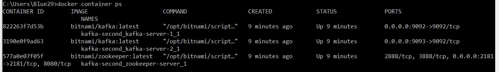
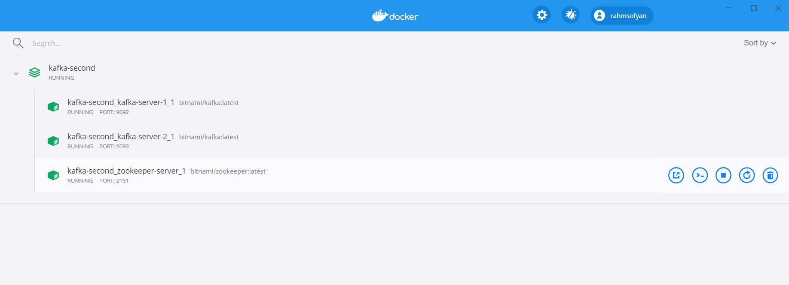
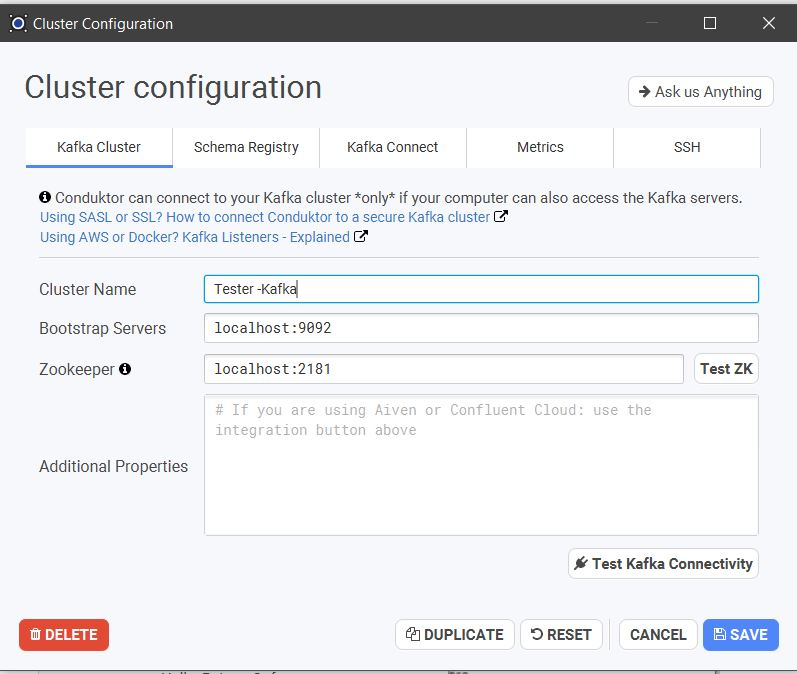
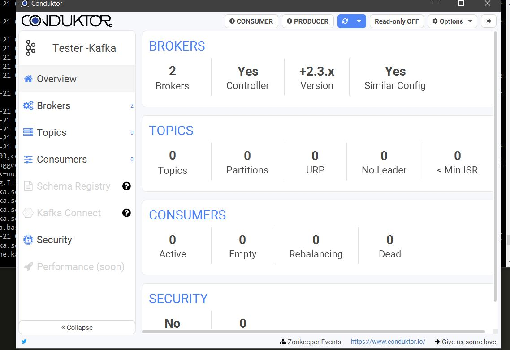

# Tugas 4 - Implementasi Infrastruktur Kafka
Nama Mahasiswa : Rahma Sofyantoro | NRP : 05111640000117  
   
## Daftar Isi   
- [Lampiran](#Lampiran)   
- [Menyiapkan Kafka Cluster menggunakan Docker](#Menyiapkan-Kafka-Cluster-menggunakan-Docker)   
- [Testing menggunakan Conduktor](#Testing-menggunakan-Conduktor)   
- [Referensi](#Referensi)   

## Lampiran
[Dockerfile](https://raw.githubusercontent.com/rahmsofyan/Big-Data/master/Tugas_4/docker-compose.yml)

## Menyiapkan Kafka Cluster menggunakan Docker
Membangun Kafka Cluster menggunakan Docker dapat dilakukan dengan menjalankan beberapa perintah docker yang dilakukan secara terpisah dan bertahap,mulai dari menyiapkan network,hingga container-container sebagai node-node cluster.   
Dapat pula dengan cara menggabungkan perintah-perintah tersebut menjadi satu menggunakan Docker-Compose. Docker-Compose akan mengkonfigurasi seluruh servis aplikasi dengan satu perintah.   

**Langkah - langkah sebagai berikut :**   
**1. Definisikan servis yang akan digunakan pada file [docker-compose.yml](https://raw.githubusercontent.com/rahmsofyan/Big-Data/master/Tugas_4/docker-compose.yml) seperti di bawah :**   
```
version: '2'

networks:
  kafka-net:
    driver: bridge

services:
  zookeeper-server:
    image: 'bitnami/zookeeper:latest'
    networks:
      - kafka-net
    ports:
      - '2181:2181'
    environment:
      - ALLOW_ANONYMOUS_LOGIN=yes
      
  kafka-server-1:
    image: 'bitnami/kafka:latest'
    networks:
      - kafka-net    
    ports:
      - '9092:9092'
    environment:
      - KAFKA_CFG_ZOOKEEPER_CONNECT=zookeeper-server:2181
      - KAFKA_CFG_ADVERTISED_LISTENERS=PLAINTEXT://localhost:9092
      - ALLOW_PLAINTEXT_LISTENER=yes
    depends_on:
      - zookeeper-server
  kafka-server-2:
    image: 'bitnami/kafka:latest'
    networks:
      - kafka-net    
    ports:
      - '9093:9092'
    environment:
      - KAFKA_CFG_ZOOKEEPER_CONNECT=zookeeper-server:2181
      - KAFKA_CFG_ADVERTISED_LISTENERS=PLAINTEXT://localhost:9093
      - ALLOW_PLAINTEXT_LISTENER=yes
    depends_on:
      - zookeeper-server
```
Pada kasus ini menggunakan 1 server zookeper,dan 2 server kafka.      
**2. Jalankan perintah ```docker-compose up```, maka Docker otomatis akan membuat servis yang sudah didefinisikan termasuk melakukan pulling terhadap repository yang dibutuhkan.**   
   
Container akan terbentuk,dan akan langsung *start* servis.
## Testing menggunakan Conduktor
Secara umum, untuk mengatahui apakah container docker telah berhasil dibuat telah berjalan atau tidak menggunakan perintah ```docker container ps``` yang akan menghasilkan :   
   
atau dapat juga melihat pada docker dashboard seperti gambar di bawah :   
   

Untuk mengetahui lebih lanjut apakah Kafka Cluster sudah berhasil dibuat dapat menggunakan tools [Conduktor](https://www.conduktor.io/). Conduktor menampilkan informasi detail mengenai Kafka Cluster yang telah dibuat seperti Brokers,Topics,Consumers,Security.

Untuk menggunkan Conduktor,lakukan konfigurasi koneksi sesuai dengan alamat server kafka dan zookeper yang telah dibuat.   
   
Berikut hasil testing menggunakan Conduktor :
   

## Referensi
[How to install Kafka using Docker by Saeed Zarinfam
](https://itnext.io/how-to-install-kafka-using-docker-a2b7c746cbdc)   
[Bitnami Docker Kafka](https://github.com/bitnami/bitnami-docker-kafka)   
[Conduktor](https://www.conduktor.io/)   
