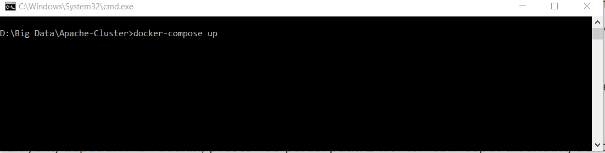

# Tugas 5 - Implementasi Apache Spark Cluster Menggunakan Docker
Nama Mahasiswa : Rahma Sofyantoro | NRP : 05111640000117  

## Daftar Isi   
- [Membuat Apache Spark Cluster menggunakan Docker](#Membuat-Apache-Spark-Cluster-menggunakan-Docker)   
- [Menjalankan Script Python pada Cluster](#Menjalankan-Script-Python-pada-Cluster)   
- [Menguji Cluster dengan Paramater Berbeda ](#Menguji-Cluster-dengan-Paramater-Berbeda)   

## Membuat Apache Spark Cluster menggunakan Docker
**1.Buat file docker-compose.yml, dan simpan pada direktori khusus file tersebut.**
**2.Definisikan service Apache Spark Cluster pada file [docker-compose.yml](https://raw.githubusercontent.com/bitnami/bitnami-docker-spark/master/docker-compose.yml) seperti di bawah :**   
```

version: '2'

services:
  spark:
    image: bitnami/spark:2
    environment:
      - SPARK_MODE=master
      - SPARK_RPC_AUTHENTICATION_ENABLED=no
      - SPARK_RPC_ENCRYPTION_ENABLED=no
      - SPARK_LOCAL_STORAGE_ENCRYPTION_ENABLED=no
      - SPARK_SSL_ENABLED=no
    ports:
      - '8080:8080'
  spark-worker-1:
    image: bitnami/spark:2
    environment:
      - SPARK_MODE=worker
      - SPARK_MASTER_URL=spark://spark:7077
      - SPARK_WORKER_MEMORY=1G
      - SPARK_WORKER_CORES=1
      - SPARK_RPC_AUTHENTICATION_ENABLED=no
      - SPARK_RPC_ENCRYPTION_ENABLED=no
      - SPARK_LOCAL_STORAGE_ENCRYPTION_ENABLED=no
      - SPARK_SSL_ENABLED=no
  spark-worker-2:
    image: bitnami/spark:2
    environment:
      - SPARK_MODE=worker
      - SPARK_MASTER_URL=spark://spark:7077
      - SPARK_WORKER_MEMORY=1G
      - SPARK_WORKER_CORES=1
      - SPARK_RPC_AUTHENTICATION_ENABLED=no
      - SPARK_RPC_ENCRYPTION_ENABLED=no
      - SPARK_LOCAL_STORAGE_ENCRYPTION_ENABLED=no
      - SPARK_SSL_ENABLED=no
      
```   
Pada konfigurasi di atas akan dibangun *service* dengan satu container Spark master, dan dua container Spark Worker.   
   
**3. Jalankan perintah** ```docker-compose up```**, maka Docker otomatis akan membuat servis yang sudah didefinisikan termasuk melakukan pulling terhadap repository yang dibutuhkan.**   
   
**4. Jalankan perintah** ```docker ps -a``` **untuk mengetahui apakah container telah berhasil dibuat atau tidak.**   
   
**5. Kunjungi** *[localhost:8080](localhost:8080)* **pada peramban untuk mengetahui apakah Spark Cluster dapat diakses atau tidak.**   
   
## Menjalankan Script Python pada Cluster
**1. Pastikan Spark cluster telah berjalan.**   
**2. Jalankan perintah** ```docker ps``` **untuk mengetahui container yang sedang berjalan.**   
   
**3. Masuk ke dalam bash container spark master menggunakan perintah :**   
```docker exec -it <container_id> /bin/bash```.   
   
**4. Submit Job pada Spark Cluster menggunakan perintah :**   
``` spark-submit --master <master-url>  <path file python> [application-arguments] ```  
   
pada kasus di atas menggunakan pi.py,sample script Python pada Apache Spark,dengan job 100.
untuk mengetahui hostname dapat menggunakan perintah ```hostname -i``` pada bash.   
   


   
## Menguji Cluster dengan Paramater Berbeda
Dilakukan uji coba terhadap Apache Spark Cluster dengan perubahan paramater worker,CPU,Partisi.
Dari ujicoba tersebut dihasilkan seperti tabel di bawah ini :   
| Worker        | CPU           | Partisi | Memory | Time (Hasil)     |
| ------------- |:-------------:| :------:|:-----: |:--------:|
|  2 | 2 | 100| 1 G | 15.383236 s|
|    | 2| 1000| 1 G | 96.638097 s|
|    | 4 | 1000| 1 G | 96.805544 s|
|  5 | 2 | 100| 1 G | 17.195362 s|
|    | 2| 1000| 1 G | 98.462424 s|
|    | 4| 1000| 1 G | 108.199901 s|
   
Pada uji coba menunjukan semakin kecil partisi maka semakin sedikit waktu yang dubutuhkan untuk menyelesaikan tugas.
Penambahan jumlah CPU yang digunakan pada partisi yang sama menunjukan peningkatan waktu eksekusi,hal ini disebabkan proses loading tugas pada CPU,sehingga menambah waktu eksekusi. Hal yang sama juga terjadi pada penambahan worker,hal ini disebabkan proses pembagian tugas pada worker yang bertambah.


## Referensi
[Docker Spark](https://hub.docker.com/r/bitnami/spark)   
[Bitnami Docker Spark](https://github.com/bitnami/bitnami-docker-spark)   

