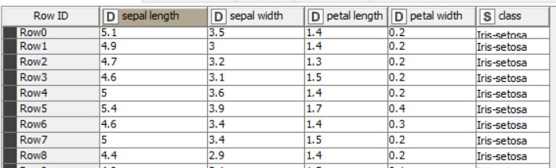
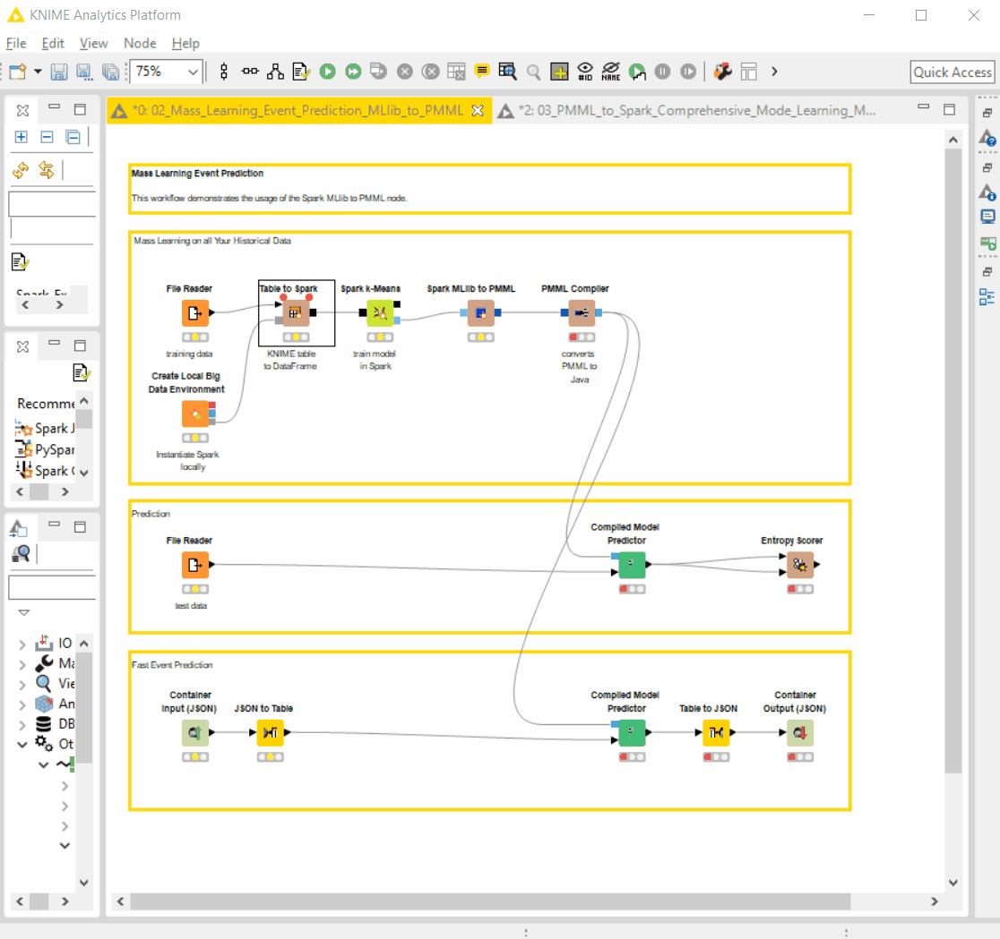
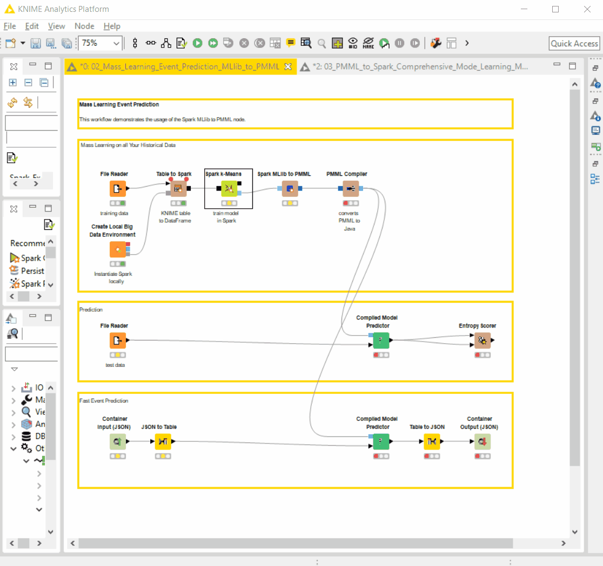
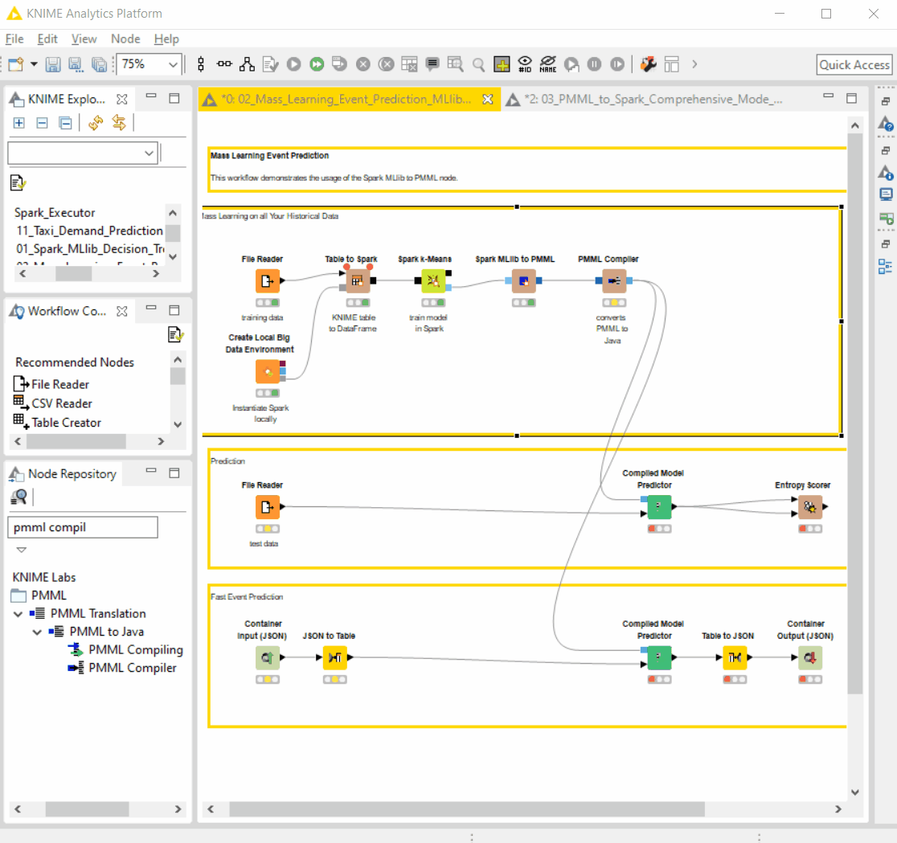
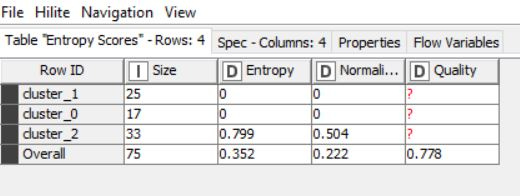
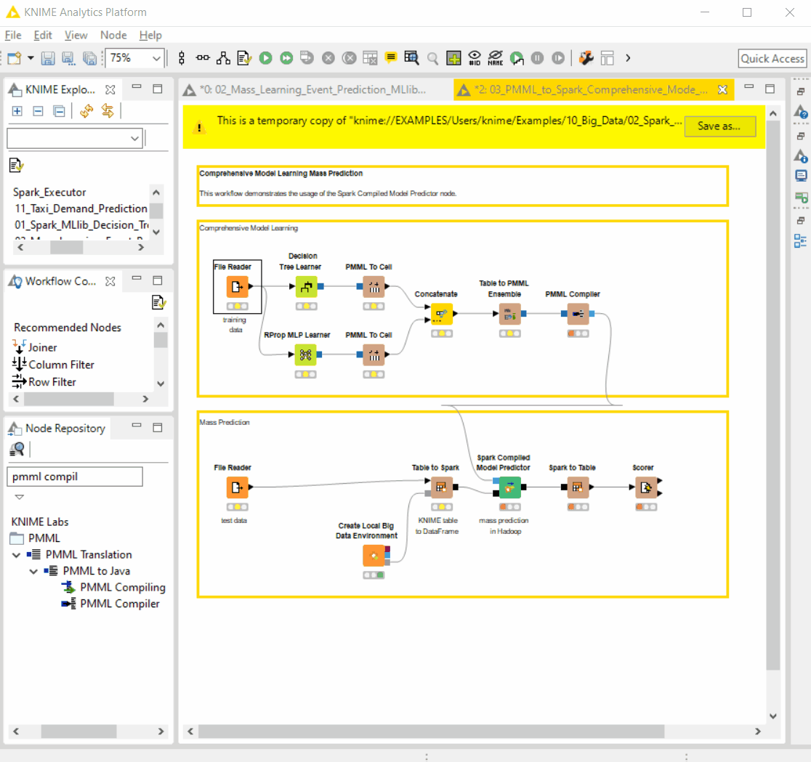
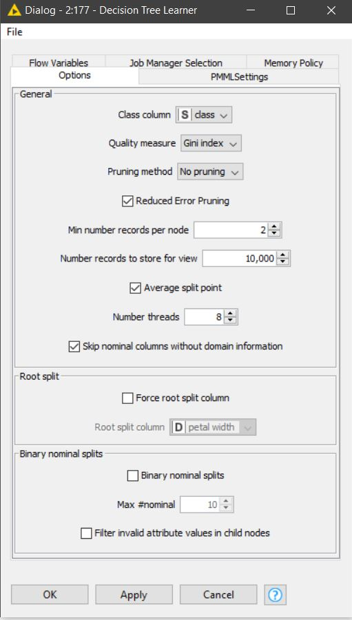
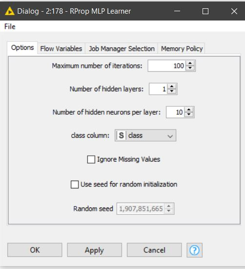
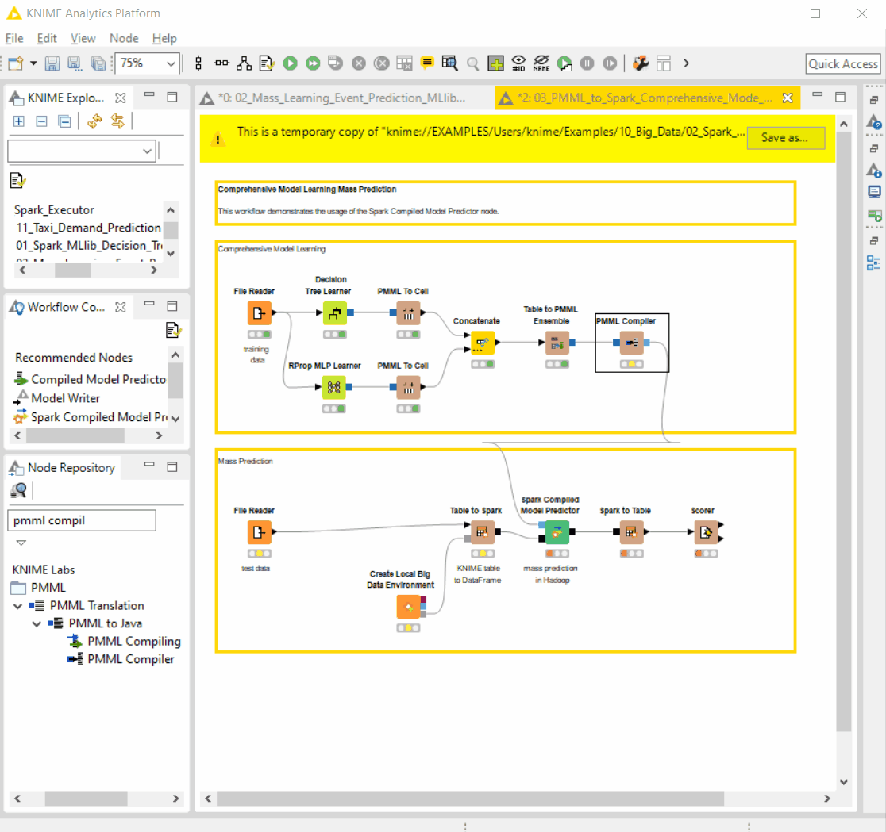
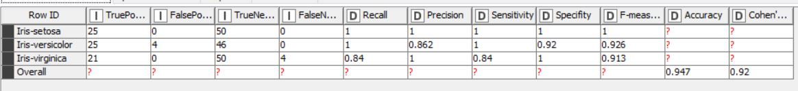

# Tugas 6 - Implementasi Spark Compiled Model Using KNIME
Nama Mahasiswa : Rahma Sofyantoro | NRP : 05111640000117  

## Daftar Isi  
- [Lampiran](#Lampiran)   
- [Dataset](#Dataset)   
- [1. CRISP-DM MLlib model to PMML](#1-CRISP-DM-MLlib-model-to-PMML)   
      [1.1. Business Understanding](#11-business-understanding)   
      [1.2. Data Understanding](#12-data-understanding)   
      [1.3. Data Preparation](#13-data-preparation)   
      [1.4. Modeling](#14-modeling)   
      [1.5. Evaluation](#15-evaluation)   
      [1.6. Deployment](#16-deployment)   
- [2. CRISP-DM Spark Compiled Model Predictor](#2-CRISP-DM-Spark-Compiled-Model-Predictor)   
      [2.1. Business Understanding](#21-business-understanding)   
      [2.2. Data Understanding](#22-data-understanding)   
      [2.3. Data Preparation](#23-data-preparation)   
      [2.4. Modeling](#24-modeling)   
      [2.5. Evaluation](#25-evaluation)   
      [2.6. Deployment](#26-deployment)   

## Lampiran
[File Model KNIME : MLlib model to PMML](https://hub.knime.com/knime/spaces/Examples/latest/10_Big_Data/02_Spark_Executor/02_Mass_Learning_Event_Prediction_MLlib_to_PMML)   
[File Model KNIME : Spark Compiled Model Predictor](https://hub.knime.com/knime/spaces/Examples/latest/10_Big_Data/02_Spark_Executor/03_PMML_to_Spark_Comprehensive_Mode_Learning_Mass_Prediction)

## 1. CRISP-DM MLlib model to PMML
### 1.1. Business Understanding
Dateset Iris merupakan dataset multivarian yang dikenalkan oleh Ronald Fisher pada papernya,*The use of multiple measurements in taxonomic problems as an example of linear discriminant analysis.* Dataset ini sering digunakan sebagai *testcase* dalam teknik klasifikasi.   
Pada studi ini dilakukan studi dengan tujuan :
- Mendapatkan prediksi jenis bunga iris dari fitur yang diinputkan menggunakan algoritma K-Means   

### 1.2. Data Understanding
Data yang digunakan dalam studi ini adalah Dataset Iris. Dataset iris ini diajukan oleh Ronald Fisher dalam *paper*-nya,*The use of multiple measurements in taxonomic problems as an example of linear discriminant analysis,1936*. Di dalam dataset terdiri dari 3 jenis bunga iris yang masing-masing sampelnya memiliki 4 fitur antara lain **lebar sepal(*sepal width*), panjang sepal(*sepal length*), labar petal(*sepal width*), dan panjang petal(*sepal length*)**. Keempat fitur tersebut dalam *float* dengna satuan cm. Jumlah keseluruhan data yang digunakan adalah 75 baris.   
Di bawah ini sampel dataset iris yang  digunakan :   
   

### 1.3. Data Preparation
Pada tahap ini, dataset iris  disiapkan ke dalam *Spark Context*. File dataset iris dibuka dan diinput kadalam spark melalui **node table to spark**.   
   
### 1.4. Modeling
Pada tahap ini dilakukan klasterisasi menggunakan algoritma K-Means untuk mengelompokan dataset menjadi 3 klaster. Proses pembelajaran data dilakukan sebanyak 30 kali iterasi di dalam Spark menggunakan **node spark K-Means**. Selanjutnya, model yang dihasilkan  disimpan kedalam **PMML**. **PMML** adalah standar pertukaran model prediksi statistik berbasi XML yang memugkinkan untuk berbagi model prediksi antar aplikasi.   
   
### 1.5. Evaluation  
Pada tahap ini dilakukan evalusi hasil klasterisasi menggunakan model yang sudah dibuat terhadap data asli. Evaluasi dilakukan dengan  PMML yang telah dibuat. PMML tersebut diubah kedalam java *bytecode* untuk digunakan pada **node compilied Model Predictor**.   
   
Hasil dari *entropy scorer* sebagai berikut :   
   
Terlihat bahwa untuk prediksi klaster 0,1 memiliki entropy 0 yang menunjukan pengelompokan berkesesuaian dengan kelas asli, sedangkan untuk klaster 2 memiliki entropy 0.799 yang menunjukan klaster 2 masih terjadi ketidaksesuaian terhadap kelas asli. 
### 1.6. Deployment   
Pada tahp ini dilakukan deployment untuk menentukan kategori kelas iris dari inputan dari file JSON yang berisi keempat fitur iris. Data dari JSON  diubah ke dalam bentuk tabel untuk dilakukan prediksi. Prediksi dilakukan dengan menggunakan model yang telah disimpan dalam PMML. Hasil prediksi dari table diubah kedalam bentuk output JSON.   
   
Dari studi yang dilakukan berhasil menghasilkan model untuk memprediksi kelas iris dari input fitur yang dimasukan.
____

## 2. CRISP-DM Spark Compiled Model Predictor
### 2.1. Business Understanding
Dateset Iris merupakan dataset multivarian yang dikenalkan oleh Ronald Fisher pada papernya,*The use of multiple measurements in taxonomic problems as an example of linear discriminant analysis.* Dataset ini sering digunakan sebagai *testcase* dalam teknik klasifikasi.   
Pada studi ini dilakukan studi dengan tujuan :
- Mendapatkan prediksi jenis bunga iris dari fitur yang diinputkan menggunakan algoritma *ensamble* dari Decision Tree dan RProp MLP berdasar  Majority-Vote

### 2.2. Data Understanding
Data yang digunakan dalam studi ini adalah Dataset Iris. Dataset iris ini diajukan oleh Ronald Fisher dalam *paper*-nya,*The use of multiple measurements in taxonomic problems as an example of linear discriminant analysis,1936*. Di dalam dataset terdiri dari 3 jenis bunga iris yang masing-masing sampelnya memiliki 4 fitur antara lain **lebar sepal(*sepal width*), panjang sepal(*sepal length*), labar petal(*sepal width*), dan panjang petal(*sepal length*)**. Keempat fitur tersebut dalam *float* dengan satuan cm. Jumlah keseluruhan data yang digunakan adalah 75 baris.   
Di bawah ini sampel dataset iris yang  digunakan :
   

### 2.3. Data Preparation
Pada tahap ini, data disiapkan dan dibaca dari file secara langsung.
   
### 2.4. Modeling
Pada tahap ini dilakukan modeling prediksi dengan menggabungkan dua algoritma Decision Tree dan RProp MLP. Hasil dari pembelajaran kedua model tersebut digabung menjadi satu table dan disimpan kedalam PMML Ensamble. Dengan menggunakan PMML Ensamble prediksi yang dihasilkan merupakan kombinasi dari kedua algoritma berdasar pemilihan secara algoritma *majority-vote*.   
Berikut pengaturan parameter untuk Decision Tree :   
   
Sedangkan untuk pengaturan parameter untuk RProp MLP :   
   
   
### 2.5. Evaluation  
Pada tahap ini dilakukan evalusi hasil klasterisasi menggunakan model yang sudah dibuat terhadap data asli. Evaluasi dilakukan dengan  PMML yang telah dibuat. PMML tersebut diubah kedalam java *bytecode* untuk digunakan pada **node compilied Model Predictor**. Data yang diprediksi disimpan dalam spark dan di prediksi menggunakan node **Spark compilled Model Predictor**.   
   
Hasil dari *accuracy scorer* sebagai berikut :   
   
Terlihat bahwa akurasi keseluruhan adalah 0.947.   
Model sudah cukup bagus untuk melakukan prediksi data.
### 2.6. Deployment   
Tidak dilakukan tahap deployment.   
Dari studi yang dilakukan berhasil menghasilkan model untuk memprediksi kelas iris dari input fitur yang dimasukan menggunakan algoritma *ensamble* dari Decision Tree dan RProp MLP berdasar Majority-Vote.
