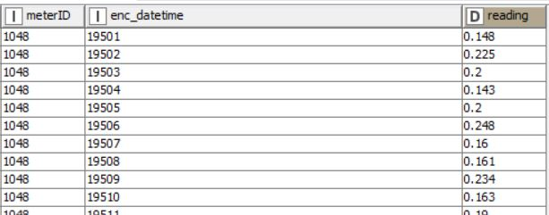
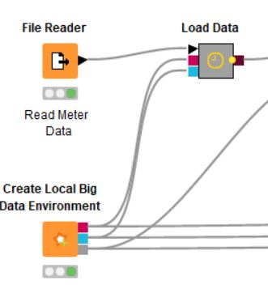
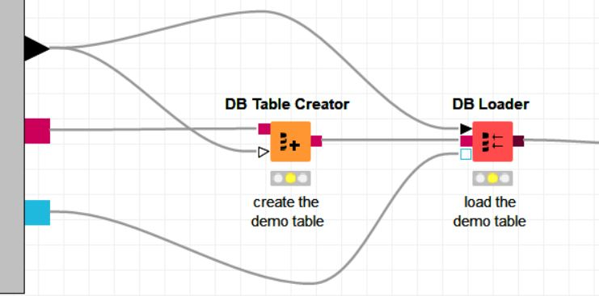
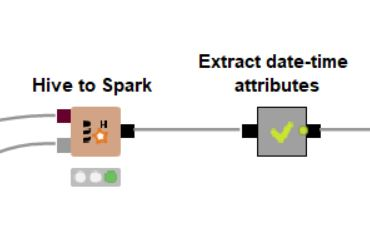
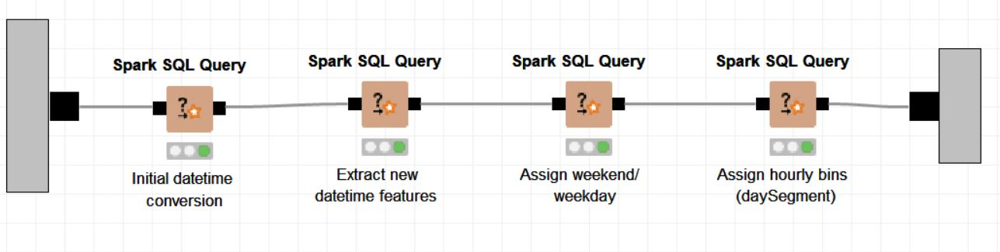
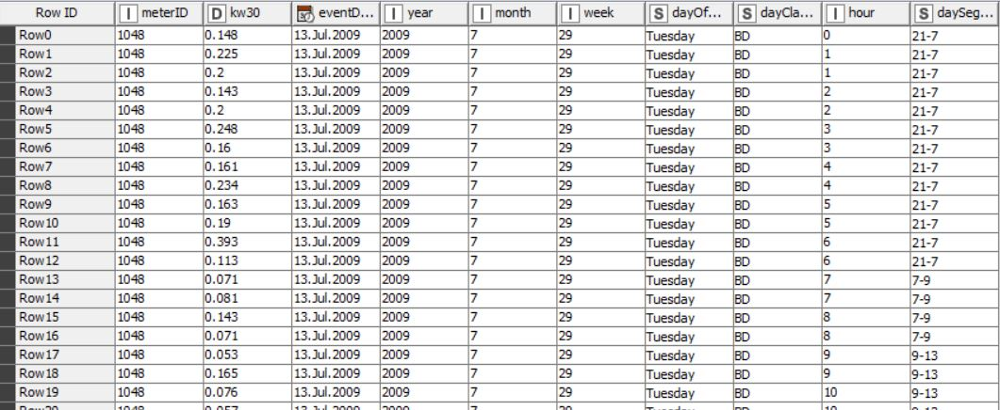

# Tugas 7 - Implementasi Local big data Irish meter KNIME
Nama Mahasiswa : Rahma Sofyantoro | NRP : 05111640000117  

## Daftar Isi  
- [Lampiran](#lampiran)   
- [CRISP-DM](#crisp-dm)   
      [Business Understanding](#business-understanding)   
      [Data Understanding](#data-understanding)   
      [Data Preparation](#data-preparation)   
      [Modeling](#modeling)   
      [Evaluation](#evaluation)   
      [Deployment](#deployment)  

## Lampiran
[File Model KNIME : Local big data Irish meter](https://hub.knime.com/knime/spaces/Examples/latest/10_Big_Data/02_Spark_Executor/09_Big_Data_Irish_Meter_on_Spark_only)   

## CRISP-DM
### Business Understanding
Listrik menjadi bagian yang tak terpisahkan dari kehidupan masyarakt modern saat ini. Hampir setiap peralatan penunjuang kehidupan manusia ditunjang oleh energi listrik. Tak ayal konsumsi listrik masyarakat semaking bertambah seiring waktu,salah satunya terjadi pada masyarkat Irlandia. Negara Irlandia menguji coba program *Smart Metering Electricity Customer Behaviour Trials*  untuk mengukur kebiasan penggunaan listrik oleh beberapa pelanggan setempat,yang nantinya akan diaplikasikan secara nasional. Dari ujicoba tersebut dilakukan studi yang nantinya dapat digunakan untuk mengetahui dampak dari konsumsi energi oleh masyarakat Irlandia.   
   

Salah satu studi yang perlu dilakukan adalah mengklasterisasi pelanggan berdasar data penggunaan listrik. Klaster-klaster pelanggan tersebut dapat digunakan sebagai acuan pemasaran produk dan strategi pengembangan produk.   
   
Pada kasus ini dilakukan studi dengan tujuan   
- Menentukan klaster dari pelanggan listrik mengggunakan algroritma K-Means dan PCA (Principal Component Analysts)

### Data Understanding
Dataset yang digunakan bersumber dari Irish Energy Meter dataset,yang merupakan kumpulan dari penggunaan listrik oleh beberapa pelanggan dari masyarakat Irlandia.   
Dataset terdiri dari 3 atribut :  
1. **MaterID** menunjukan ID pelanggan
2. **Enc_datetime** menunjukan waktu penggunaan
3. **Reading** menunjukan KW (kilowatt) per 30 menit   
   
Jumlah keseluruhan baris adalah 1226829 baris.   
Dibawah ini merupakan sample dari dataset :   
   

### Data Preparation
Pada tahap persiapan data, secara berurutan dilakukan ***loading* data kedalam SPARK**, **ekstraksi pada atribut *enc_datatime***, **Agregasi terhadap hasil ekstraksi**,dan terakhir **mengubah hasil agregasi dapam bentuk persentase**.Hasil akhir dalam bentuk presentasi tersebut yang akan digunakan sebagai data training pada model.
#### 1. Load Data 
Dataset awal yang disimpan dalam bentuk csv dibuka dengan **`Node File Reader`** ,dilanjutkan pembuatan local Spark Contect **`Node Create Local Big Data Environment`** ,lalu data di*-load* kedalam Spark* delam bentuk tabel baru. Proses *loading* data dilakukan di **`Metanode load data`**  yang berisikan **`Node Table Creator`**  untuk menyimpan dataset kedalam tabel,dan **`Node DB Loader `** untuk loading data kedalam Spark Context.   
   
Berikut skema keseluruhan load data :   
   
Berikut skema **metanode Loaddata** :  
   
Proses keseluruhan :   
   
#### 2. Ekstraksi Atribut enc_datetime
Pada Dataset,atribut enc_datatime yang merupakan waktu penggunaan masih dalam berbentuk pengkodean integer sehingga perlu diekstraksi untuk mendapatakan waktu asli yang dapat diagregasi pada tahap selanjutnya.   
   
Pada enc_datetime, 3 digit awal menunjukan jumlah hari diawali dari 1 Januari 2009.   
Misalnya : 00501 berarti waktu penggunaan pada 5 Januari 2009.   
Sedangkan 2 digit akhir menunjukan jumlah 30 menit diawali dari pukul 00:00.   
Misalnya : 00501 berati waktu penggunaan pada pukul 00:30.   

Query dilakukan di dalam spark context, dimana pada konfigurasi KNIME spark context sebelumnya menggunakan kerangka Kerja Hive (*default*) untuk query dan analis datanya. Selanjutnya digunakan Spark SQL sebagai pengganti Hive untuk query dan analisis data dengan **`Node Hive to Spark`** . Spark SQL akan melakukan operasinya kompleksnya dalam memori dan eksekusi volume data dalam bentuk SparkDataFrame/RDD, sehingga performa lebih cepat dan efisien.   

Proses ekstraksi dilakukan dalam 4 tahapan dimana setiap tahapan dilakukan secara berurutan dan hasil ekstraksi pada tahap sebelumnya akan digunakan untuk diekstrak kembali pada tahap selanjutnya.Ekstraksi dilakukan dengan **`Node Spark SQl `**.   
**Ekstraksi yang dilakukan antara lain :**   
**1.Ekstraksi tanggal dan pukul**   
Ekstraksi pada tahap pertama ini menghasilkan tanggal penggunaan yang disimpan dalam **atribut eventdate** dan pukul akhir penggunaan dalam atribut **my_time**.   
Berikut query sql yang digunakan :   
```
SELECT 

meterid,
enc_datetime,
reading as kw30,
date_add(cast('2008-12-31' as timestamp), cast(substr(enc_datetime, 1, 3) as int)) as eventDate,
concat(
 substr(concat("00", cast(cast((cast(substr(enc_datetime, 4) as int) * 30 / 60) as int) %24 as string)),-2,2),":", 
 substr(concat("00", cast(cast(cast(substr(enc_datetime, 4) as int) * 30 % 60 as int) as string)), -2, 2)
) as my_time

FROM #table# t1
```
   
**2.Ekstraksi jam,hari,minggu,bulan,dan tahun**   
Ekstraksi Kedua ini menghasilkan jam dalam **hour**,hari dalam **dayofweek**,minggu dalam **week** ,bulan dalam **month**,dan tahun dalam **year**. Hasil ekstraksi ini berasal dari ekstraksi yang pertama.
Berikut query sql yang digunakan :   
```
SELECT 

meterid,
kw30,
eventDate,
year(eventDate) as year,
month(eventDate) as month,
weekofyear(eventDate) as week,
date_format(eventDate, 'EEEE') as dayOfWeek,
hour(my_time) as hour

FROM #table# t1
```
   
**3.Ekstraksi kategori jenis hari**   
Ekstraksi ketiga ini menghasilkan kategori jenis hari dalam atibut **dayclassifier** ,BD untuk hari kerja , WE untuk hari non-kerja atau akhir pekan. Hasil ekstraksi ini berasal dari ekstraksi yang kedua.  
Berikut query sql yang digunakan :   
```
SELECT *, 
CASE 
WHEN dayOfWeek in ('Saturday','Sunday') 
      THEN 'WE' 
      ELSE 'BD' 
END as dayClassifier

from #table#
```

    
**4.Ekstraksi segmen 24jam sehari**   
Ekstraksi terakhir ini menghasilkan segmentasi 24 jam sehari dalam atibut **daysegment** . Terdapat 5 segmen untuk 24 jam sehari antari lain "7-9","9-13","13-17","17-21",dan "21-7" . Hasil ekstraksi ini berasal dari ekstraksi yang ketiga.   
Berikut query sql yang digunakan :   
```
SELECT meterID, kw30, eventDate, year, month, week, dayOfWeek, dayClassifier, hour,
CASE 
WHEN hour >=7 AND hour <9 THEN '7-9'
WHEN hour >=9 AND hour <13 THEN '9-13' 
WHEN hour >=13 AND hour <17 THEN '13-17' 
WHEN hour >=17 AND hour <21 THEN '17-21' 
WHEN hour >=21 OR hour <7 THEN '21-7'  
								 
END as daySegment

from #table#
```
Berikut skema keseluruhan ekstraksi Atribut enc_datetime :   
   
Berikut skema **metanodeAtribut enc_datetime** :  
   
Proses keseluruhan :  
   
Tabel sampel hasil ekstraksi terakhir :
   

     
     
### Modeling
### Evaluation  
### Deployment   
