# Tugas 7 - Implementasi Local big data Irish meter KNIME
Nama Mahasiswa : Rahma Sofyantoro | NRP : 05111640000117  

## Daftar Isi  
- [Lampiran](#lampiran)   
- [CRISP-DM](#crisp-dm)   
      [Business Understanding](#business-understanding)   
      [Data Understanding](#data-understanding)   
      [Data Preparation](#data-preparation)   
      [Modeling](#modeling)   
      [Evaluation](#evaluation)   
      [Deployment](#deployment)  

## Lampiran
[File Model KNIME : Local big data Irish meter](https://hub.knime.com/knime/spaces/Examples/latest/10_Big_Data/02_Spark_Executor/09_Big_Data_Irish_Meter_on_Spark_only)   

## CRISP-DM
### Business Understanding
Listrik menjadi bagian yang tak terpisahkan dari kehidupan masyarakt modern saat ini. Hampir setiap peralatan penunjuang kehidupan manusia ditunjang oleh energi listrik. Tak ayal konsumsi listrik masyarakat semaking bertambah seiring waktu,salah satunya terjadi di Irlandia. Negara Irlandia menguji coba program *Smart Metering Electricity Customer Behaviour Trials*  untuk mengukur kebiasan penggunaan listrik oleh beberapa pelanggan yang merupakan warga setempat,yang nantinya program ini akan diaplikasikan secara nasional. Dari ujicoba tersebut dilakukan studi yang agar dapat digunakan untuk mengetahui dampak dari konsumsi energi oleh masyarakat Irlandia.   
   
Salah satu studi yang perlu dilakukan adalah *clustering* pelanggan berdasar data penggunaan listrik. Klaster-klaster pelanggan tersebut dapat digunakan sebagai acuan pemasaran produk dan strategi pengembangan produk.   
   
Pada kasus ini dilakukan studi dengan tujuan   
- Menentukan klaster dari pelanggan listrik mengggunakan algroritma K-Means dan PCA (Principal Component Analysts)

### Data Understanding
Dataset yang digunakan bersumber dari Irish Energy Meter dataset,kumpulan dari penggunaan listrik oleh beberapa pelanggan yang merupakan penduduk Irlandia.
Dataset terdiri dari 3 atribut :  
1. **MaterID** menunjukan ID pelanggan
2. **Enc_datetime** menunjukan waktu penggunaan
3. **Reading** menunjukan KW (kilowatt) per 30 menit   
   
Jumlah keseluruhan 1226829 baris.   
Dibawah ini merupakan sample dari dataset :   
   

### Data Preparation
Pada tahap persiapan data, secara berurutan ***loading* data kedalam Spark**, **ekstraksi pada atribut *enc_datatime***, **agregasi terhadap hasil ekstraksi**,dan terakhir **menghitung persen dari penggunaan harian dan segemn jam**. Data hasil persiapan ini akan menjadi data training dari model.   
#### 1. Loading Data kedalam Spark
Dataset awal yang disimpan dalam bentuk csv dibuka dengan **`Node File Reader`** ,dilanjutkan pembuatan local Spark Contect dengan **`Node Create Local Big Data Environment`** ,lalu data di-*load* kedalam Spark delam bentuk tabel baru. Proses *loading* data dilakukan di **`Metanode load data`**  yang berisikan **`Node Table Creator`**  untuk menyimpan dataset kedalam tabel,dan **`Node DB Loader `** untuk loading data kedalam Spark Context.   
   
Berikut skema keseluruhan load data :   
   
Berikut skema **metanode Loaddata** :  
   
Proses keseluruhan :   
   
#### 2. Ekstraksi Atribut enc_datetime
Pada Dataset,atribut enc_datatime yang merupakan waktu penggunaan masih dalam berbentuk pengkodean integer sehingga perlu diekstraksi untuk mendapatakan waktu asli yang dapat diagregasi pada tahap selanjutnya.   
   
Pada enc_datetime, 3 digit awal menunjukan jumlah hari diawali dari 1 Januari 2009.   
Misalnya : 00501 berarti waktu penggunaan pada 5 Januari 2009.   
Sedangkan 2 digit akhir menunjukan jumlah 30 menit diawali dari pukul 00:00.   
Misalnya : 00501 berati waktu penggunaan pada pukul 00:30.   

Query dilakukan di dalam spark context, dimana pada konfigurasi KNIME spark context sebelumnya menggunakan kerangka Kerja Hive (*default*) untuk query dan analis datanya. Selanjutnya digunakan Spark SQL sebagai pengganti Hive untuk query dan analisis data dengan **`Node Hive to Spark`** . Spark SQL akan melakukan operasi kompleks dalam memori dan mengeksekusi volume data dalam bentuk SparkDataFrame/RDD, sehingga performa lebih cepat dan efisien.   

Proses ekstraksi dilakukan dalam 4 tahapan dimana setiap tahapan dilakukan secara berurutan, dan hasil ekstraksi pada tahap sebelumnya akan digunakan untuk diekstraksi kembali pada tahap selanjutnya.Ekstraksi dilakukan menggunakan **`Node Spark SQL`.**
   
**Tahapan ekstraksi yang dilakukan antara lain :**   
**1.Ekstraksi tanggal dan pukul (*Initial datetime conservation*)**    
Ekstraksi pada tahap pertama ini menghasilkan tanggal penggunaan yang disimpan dalam **atribut eventdate** dan pukul akhir penggunaan dalam atribut **my_time**.   
Berikut query sql yang digunakan :   
```
SELECT 

meterid,
enc_datetime,
reading as kw30,
date_add(cast('2008-12-31' as timestamp), cast(substr(enc_datetime, 1, 3) as int)) as eventDate,
concat(
 substr(concat("00", cast(cast((cast(substr(enc_datetime, 4) as int) * 30 / 60) as int) %24 as string)),-2,2),":", 
 substr(concat("00", cast(cast(cast(substr(enc_datetime, 4) as int) * 30 % 60 as int) as string)), -2, 2)
) as my_time

FROM #table# t1
```
   
**2.Ekstraksi jam,hari,minggu,bulan,dan tahun (*extract new datetime*)**   
Ekstraksi Kedua ini menghasilkan jam dalam **hour**,hari dalam **dayofweek**,minggu dalam **week** ,bulan dalam **month**,dan tahun dalam **year**. Hasil ekstraksi ini berasal dari ekstraksi yang pertama.
Berikut query sql yang digunakan :   
```
SELECT 

meterid,
kw30,
eventDate,
year(eventDate) as year,
month(eventDate) as month,
weekofyear(eventDate) as week,
date_format(eventDate, 'EEEE') as dayOfWeek,
hour(my_time) as hour

FROM #table# t1
```
   
**3.Ekstraksi kategori jenis hari (*assign weekend/weekday*)**   
Ekstraksi ketiga ini menghasilkan kategori jenis hari dalam atibut **dayclassifier** ,BD untuk hari kerja , WE untuk hari non-kerja atau akhir pekan. Hasil ekstraksi ini berasal dari ekstraksi yang kedua.  
Berikut query sql yang digunakan :   
```
SELECT *, 
CASE 
WHEN dayOfWeek in ('Saturday','Sunday') 
      THEN 'WE' 
      ELSE 'BD' 
END as dayClassifier

from #table#
```

    
**4.Ekstraksi segmen 24jam sehari (*assign hourly bins (daysegment)*)**   
Ekstraksi terakhir ini menghasilkan segmentasi 24 jam sehari dalam atibut **daysegment** . Terdapat 5 segmen untuk 24 jam sehari antari lain "7-9","9-13","13-17","17-21",dan "21-7" . Hasil ekstraksi ini berasal dari ekstraksi yang ketiga.   
Berikut query sql yang digunakan :   
```
SELECT meterID, kw30, eventDate, year, month, week, dayOfWeek, dayClassifier, hour,
CASE 
WHEN hour >=7 AND hour <9 THEN '7-9'
WHEN hour >=9 AND hour <13 THEN '9-13' 
WHEN hour >=13 AND hour <17 THEN '13-17' 
WHEN hour >=17 AND hour <21 THEN '17-21' 
WHEN hour >=21 OR hour <7 THEN '21-7'  
								 
END as daySegment

from #table#
```
   
Dari ekstraksi atribut enc_datetime didapatkan 9 fitur baru antara lain :   
**`kw30,eventDate,year,month,week,dayOfWeek,dayClassifier,hour,daySegment`**   
Berikut skema keseluruhan ekstraksi Atribut enc_datetime :   
   
Berikut skema **metanode Atribut enc_datetime** :  
   
Berikut proses keseluruhan :  
   
Tabel sampel hasil ekstraksi terakhir :
   
    

#### 3. Agregasi terhadap hasil ekstraksi
Sebelum dilakukan agregasi,untuk mempercepat operasi maka data masukan dari Spark SQL diubah menjadi *persistent* RDD tipe MEMORY_ONLY dengan **`Node Persistant Spark Dataframe/RDD`**. *Persistent* RDD memungkinkan Data disimpan dalam JVM dan untuk komputasi dilakukan di dalam memori. Sehingga apabila data dimasa depan berasal dari turunan yang sama dari data yang sedang dikomputasi maka waktu komputasi selanjutnya akan lebih cepat. 
   
Hasil Ekstraksi sebelumnya diagregasi kedalam 7 kelompok agregat,yaitu :   
**1.Total penggunaan atau *total usage*.**   
Pada kelompok ini dilakukan operasi *sum* kwh berdasar **`materID`**.Hasil dari operasi disimpan dalam atribut baru,**`totalKW`**.   
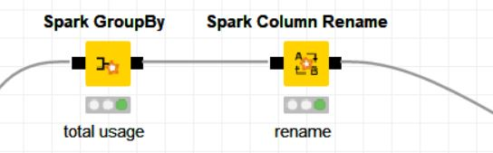   
   
**2.Rata-rata penggunaan per tahun atau *usage by year.***   
Pada kelompok ini dilakukan operasi *sum* kwh berdasar **`materID`** dan **`year`**.Hasil tersebut dirata-rata berdasar **`materID`** dan disimpan dalam atribut baru **`avgYearlyKW`**.   
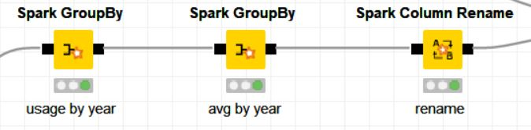   
   
**3.Rata-rata penggunaan per bulan atau *usage by month.***   
Pada kelompok ini dilakukan operasi *sum* kwh berdasar **`materID`** ,**`month`**,dan **`year`**.Hasil tersebut dirata-rata berdasar **`materID`** dan disimpan dalam atribut baru **`avgMonthlyKW`**.   
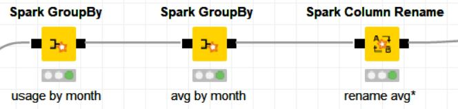   
   
**4.Rata-rata penggunaan per minggu atau *usage by week.***   
Pada kelompok ini dilakukan operasi *sum* kwh berdasar **`materID`** ,**`week`**,dan **`year`**.Hasil tersebut dirata-rata berdasar **`materID`** dan disimpan dalam atribut baru **`avgWeeklyKW`**.   
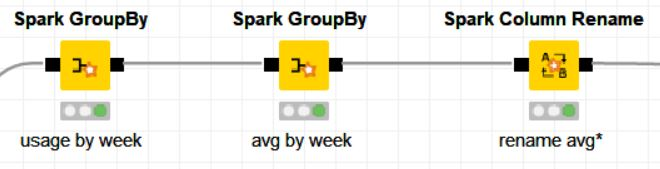   
   
**5.Rata-rata penggunaan per masing-masing hari atau *usage by days of week.***   
Pada kelompok ini dilakukan operasi *sum* kwh berdasar **`materID`** ,**`week`**,**`daysofweek`**,dan **`year`**.Hasil tersebut dirata-rata berdasar **`materID`** dengan *pivoting* pada **`daysofweek`**  ,dan disimpan dalam atribut baru **`avgMonday`**,**`avgTuesday`**,**`avgWednesday`**,**`avgThursday`**,**`avgFriday`**,**`avgSaturday`**,atau **`avgSunday`**.   
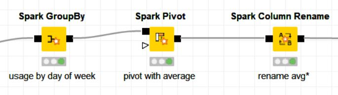   
   
**6.Rata-rata penggunaan per hari atau *usage by day.***   
Pada kelompok ini dilakukan operasi *sum* kwh berdasar **`materID`** ,**`eventDate`**.Hasil tersebut dirata-rata berdasar **`materID`** dan disimpan dalam atribut baru **`avgWDaily`**.   
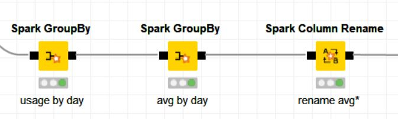   
   
**7.Rata-rata penggunaan per masing-masing segmen jam atau *usage by day segment.***   
Pada kelompok ini dilakukan operasi *sum* kwh berdasar **`materID`** ,**`evenDate`**,dan **`daySegment`**.Hasil tersebut dirata-rata berdasar **`materID`** dengan *pivoting* pada **`daySegment`**  ,dan disimpan dalam atribut baru **`avg_7to9`**,**`avg_9to13`**,**`avg_13to17`**,**`avg_17to21`**,atau **`avg_21to7`**.   
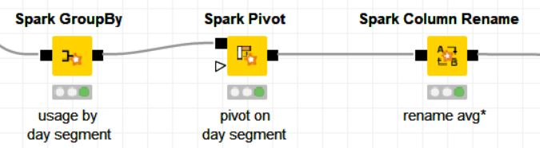   
   
**8.Rata-rata penggunaan per masing-masing jenis hari *usage by day classifier.***   
Pada kelompok ini dilakukan operasi *sum* kwh berdasar **`materID`** ,**`year`**,**`month`**,**`week`**,dan **`dayclassifier`**.Hasil tersebut dirata-rata berdasar **`materID`** dengan *pivoting* pada **`dayClassifier`**  ,dan disimpan dalam atribut baru **`avg_BD`**,atau **`avg_WE`**.   
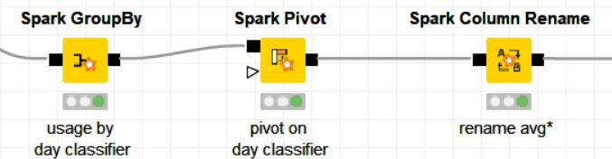   
   
**9.Rata-rata penggunaan per jam atau *usage by hour*.**   
Pada kelompok ini dilakukan operasi *sum* kwh berdasar **`materID`** ,**`eventDate`**,dan **`hour`**.Hasil tersebut dirata-rata berdasar **`materID`** dan disimpan dalam atribut baru **`avgHourly`**.     
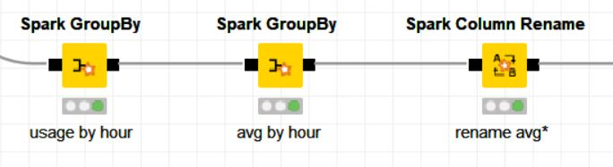   

Pada agregasi di atas operasi *sum* dan rata-rata berdasar atribut tertentu menggunakan **`node Spark GroupBy`**,sedangkan untuk 
rata-rata pivoting menggunakan **`node Spark Pivot`**.
Hasil untuk masing-masing agregasi di atas dilakukan join dengan **`node Spark Joiner`**. Dari hasil join tersebut didapatkan 20 atribut fitur dari dataset antara lain :   
**`totalKW,avgYearlyKW,avgMonthlyKW,avgWeeklyKW,avgMonday,avgTuesday,avgWednesday,avgThursday,avgFriday,avgSaturday,avgSunday,avgDaily,avg_7to9,avg_9to13,avg_13to17,avg_17to21,avg_21to7,avg_BD,avg_WE,avgHourly`**.

Berikut skema **metanode Aggregations and time series** :  
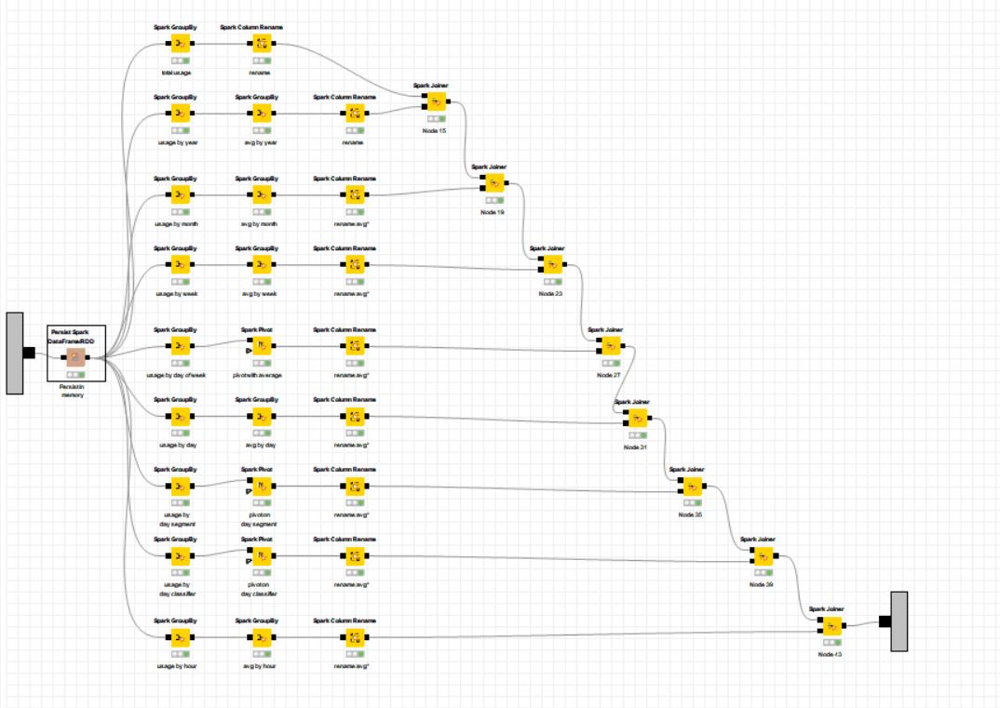   
Berikut Salah satu proses dari Agregasi *usage by days of week* : 
   
Tabel sampel hasil agreagasi terakhir :   
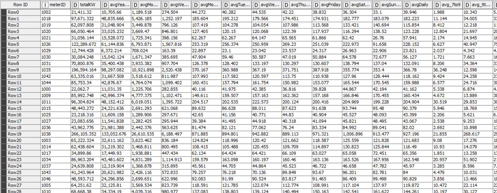
    
#### 4. Menghitung Persen dari penggunaan harian dan segmen jam
Pada tahap ini dilakukan perhitungan persentase rata-rata penggunaan KW masing-masing hari dalam seminggu (**`avgMonday, avgTuesday, avgWednesday, avgThursday, avgFriday, avgSaturday, avgSunday`**) per rata-rata penggunaan KW per minggu **`avgWeekly`**),dan rata-rata peggunaan berdasar segmen jam  (**`avg_7to9, avg_9to13, avg_13to17, avg_17to21, avg_21to7`**) per rata-rata penggunaan perhari (**`avgDaily`**). Perhitungan presentase menggunakan query SQL dengan  **`Node Spark SQL`**.   
Berikut query sql yang digunakan :   
```
SELECT `meterID`, `totalKW`, `avgYearlyKW`,`avgMonthlyKW`,`avgWeeklyKW`,
       `avgMonday`,`avgTuesday`,`avgWednesday`,`avgThursday`,`avgFriday`,`avgSaturday`,`avgSunday`,
       `avgDaily`,`avg_7to9`,`avg_9to13`,`avg_13to17`,`avg_17to21`,`avg_21to7`,`avg_BD`,`avg_WE`,`avgHourly`,
       (avgMonday / avgWeeklyKW) * 100.0 as pctMonday,
       (avgTuesday / avgWeeklyKW) * 100.0 as pctTuesday,
       (avgWednesday / avgWeeklyKW) * 100.0 as pctWednesday,
       (avgThursday / avgWeeklyKW) * 100.0 as pctThursday,
       (avgFriday / avgWeeklyKW) * 100.0 as pctFriday,
       (avgSaturday / avgWeeklyKW) * 100.0 as pctSaturday,
       (avgSunday / avgWeeklyKW) * 100.0 as pctSunday,
       (avg_7to9 / avgDaily) * 100.0 as pct_7to9,
       (avg_9to13 / avgDaily) * 100.0 as pct_9to13,
       (avg_13to17 / avgDaily) * 100.0 as pct_13to17,
       (avg_17to21 / avgDaily) * 100.0 as pct_17to21,
       (avg_21to7 / avgDaily) * 100.0 as pct_21to7
       
FROM #table#
```
   
Hasil dari presentasi tersebut ditambahkan kembali sebagai atribut baru pada dataset. Atribut tabel bertambah **`pctMonday, pctTuesday,pctWednesday,pctThursday,pctFriday,pctSaturday,pctSunday,pct_7to9,pct_9to13,pct_13to17,pct_17to21,pct_21to7`**.   
Berikut proses menghitung presentase dari penggunaan harian dan segmen jam : 
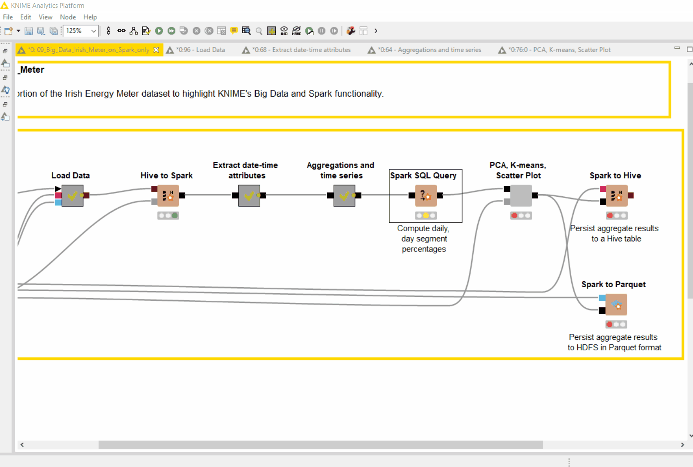   
Tabel sampel hasil perhitangan presentase:   
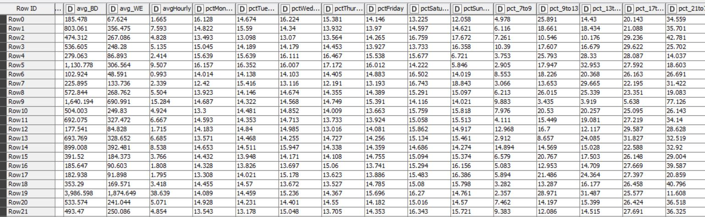

Pada hasil akhir dari persiapan data diperoleh 32 fitur yang diperoleh dari ekstraksi dataset asli.

### Modeling
Pada tahap modeling ini akan dilakukan *clustering* terhadap data yang telah disiapkan sebelumnya. Metode yang digunakan untuk *clustering* adalah K-Means dan PCA. Metode PCA digunakan untuk pembanding hasil *clustering* oleh K-Means pada tahap *Evaluation*.
Selain itu PCA juga digunakan untuk menghasilkan atribut baru hasil reduksi fitur-fitur sebelumnya.
   
Sebelum *clustering* data training dilakukan *preprocessing* terlebih dahulu dengan menormalisasi setiap *field* dalam atribut dengan **`node Spark Normalizer`**. Normalisasi yang dilakukan adalah dengan transofrmasi linear dengan minimum nilai 0 dan maksimum nilai 1. Tujuan dari normalisasi ini adalah untuk menyamakan rentang tiap *field* data training.

Metode PCA yang digunakan memiliki target dimensi dengan acuan fraksi informasi minimum yang dipertahankan sebesar 96% yang bersumber dari seluruh fitur yang digunakan.   
Berikut parameter PCA :   
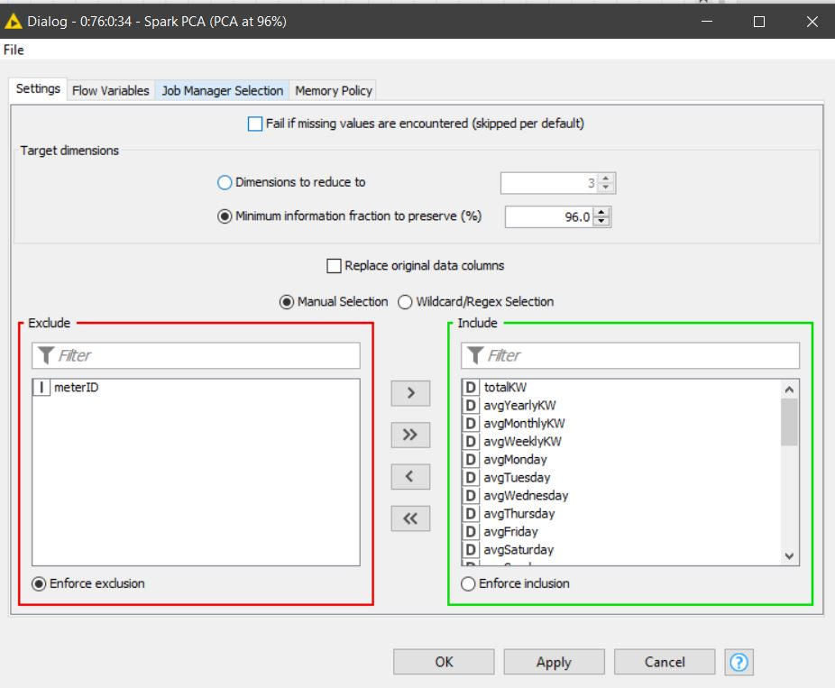   
Hasilnya berupa 8 variabel *Principal component*.   
Berikut hasil dari PCA:   
   
   
   
Sedangkan untuk K-Means memiliki target klaster 3 dengan 300 kali iterasi training. Fitur yang digunakan untuk training adalah seluruh fitur dari data training.  
Berikut parameter K-Means :   
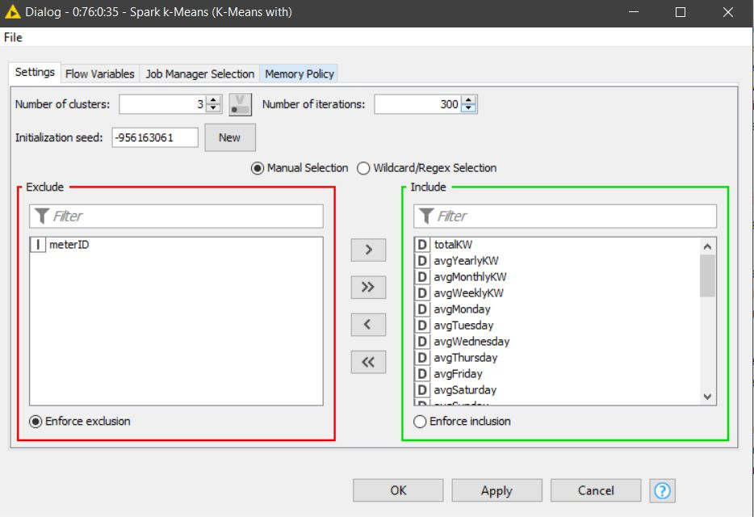   
Berikut hasil dari K-Means:   
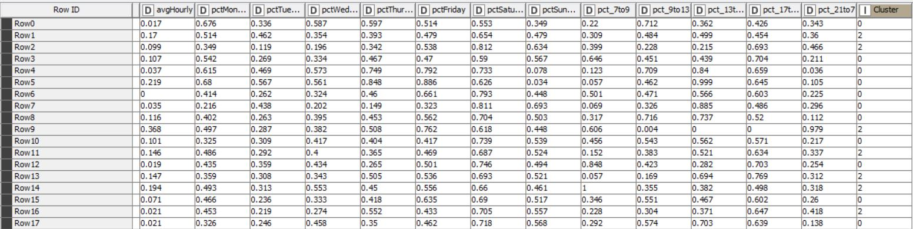   

Hasil dari PCA dan K-Means akan di-*join* dengan mempertahankan atribut lama,dan diubah dari RDD ke tabel KNIME dengan **`node Spark to Table`** untuk evaluasi nantinya.    
Berikut proses modeling : 
   

### Evaluation  
Pada tahap evaluasi ini dibandingkan performa hasil *clustering* dengan sebaran data dalam bidang koordinat *component principal* ke 0 dan 1.   
   
Data masukan dari tahap modeling didenormalisasi terhadap *field-field* sebelumnya yang dilakukan normalisasi dengan **`node Denormalize(PMML)`** sebelum digunakan untuk evaluasi. Dernormalisasi ini bertujuan mendapatkan nilai *field* asli yang nantinya akan disimpan pada tahap Deployemnt.   
   
Nilai atrbiut **cluster** yang sebelumnya bertipe data integer akan diubah ke dalam string dengan **`node Number To String`**, untuk memperjelas fungsi atribut sebagai label data. Selanjutnya performa hasil *clustering* dari K-Means dibandingankan dangan sebaran data pada bidang koordinat variabel *component principal*. Sumbu X bidang koordinat variabel *component principal* berdasar **PCA dimension 0**,sedangkan sumbu Y berdasar **PCA dimension 1**. Pemilihan PCA dimensi 0 dan 1 untuk sumbu koordinat dikarenakan pada dimensi tersebut paling merepresentasikan dari rangkuman fitur-fitur sebelumnya. Visualisasi menggunakan ploting KNIME dari **`Scatter Plot`** yang sebelumnya data telah ditandai dengan warna sesuai klasternya dengan **node Color Manager**.   ,
   
Berikut sebaran data pada bidang koordinat variabel *component principal*:   
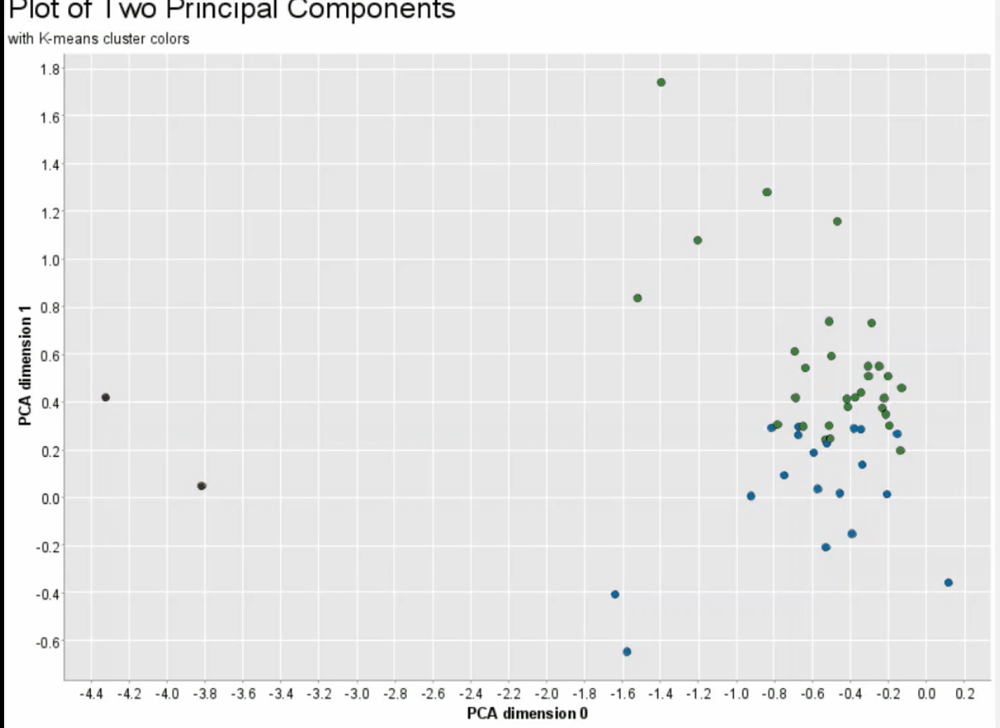   
Berikut sampel data hasil penandaan warna pada klaster :   
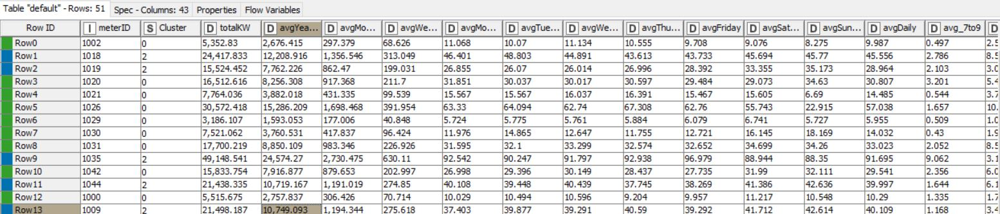   

Terlihat bahwa hasil sebaran data dengan klaster yang sama pada bidang koordinat variabel *component principal* berkelompok pada wilayah yang relatif berdekatan,hal itu menunjukan adanya kesamaan fitur-fitur yang dimiliki yang direpresentasikan oleh nilai *component principal* 0 dan 1. Sehingga disimpulkan model telah cukup baik untuk mengklasterisasi dataset sesuai berdasar kesamaan fitur-fitur.
Berikut proses evaluasi:   
   


### Deployment   
Pada tahap ini dilakukan deployment ,data hasil denormalisasi sebelumnya disimpan terlebih dahulu kedalam Hive yang merupakan local spark contect yang dibuat sebelumnya,dan Parquet file.Parquet file merupakan file penyimpanan berbentuk kolom untuk ekosistem Hadoop. Untuk menyimpan data kedalam hive menggunakan **`node Spark to Hive`**,sedangkan kedalam parquet file menggunakan **`node Spark To Parquet`**.

Sebelum data disimpan,data hasil denormalisasi pada tahap evaluasi sebelumnya yang berupa tabel KNIME akan diubah kembali RDD Spark dengan **`node Table to Spark`**.Selanjutnya, nama atribut *component principal* yang sebelumnya dengan dipisah dengna *space* diubah dipisah dengan *underscore*.
   
Berikut proses deployemnt:   


Berikut hasil ujicoba query pada data yang telah tersimpan dalam hive :   
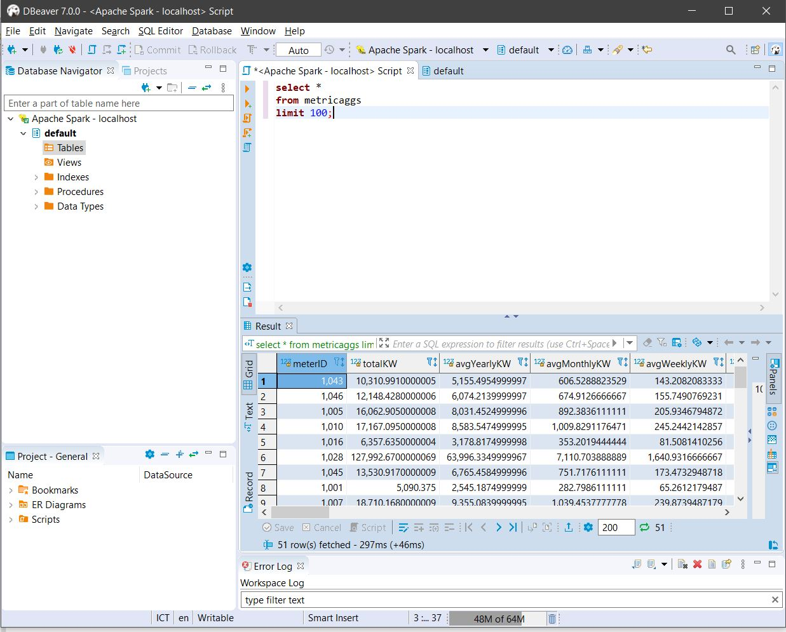

Dari hasil ujicoba terlihat bahwa data telah tersimpan dalam Hive.


